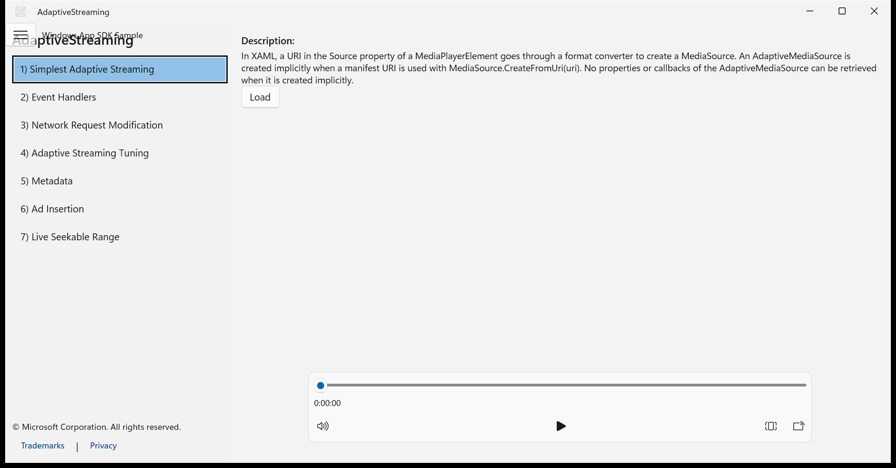
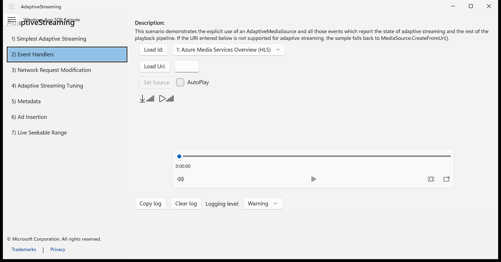
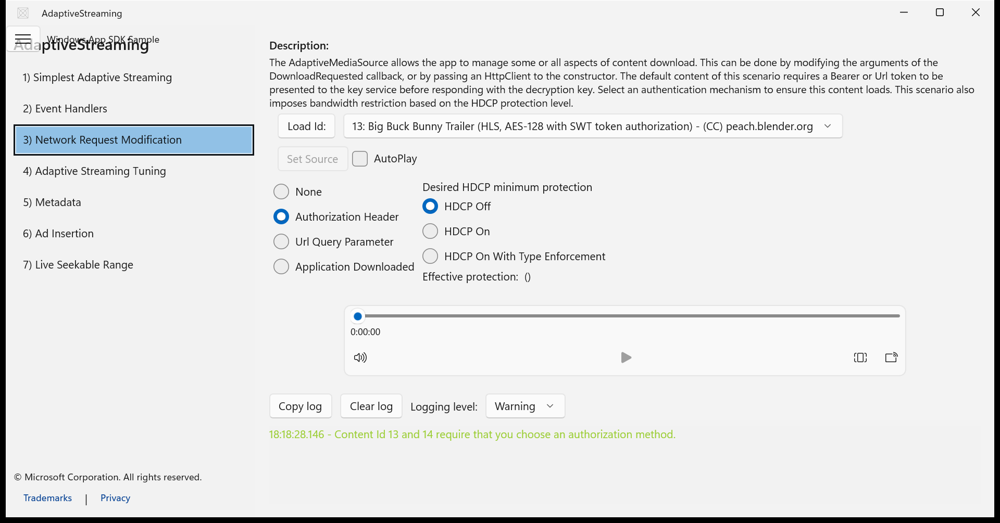
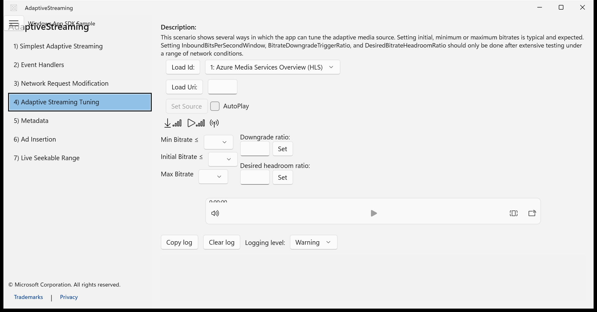
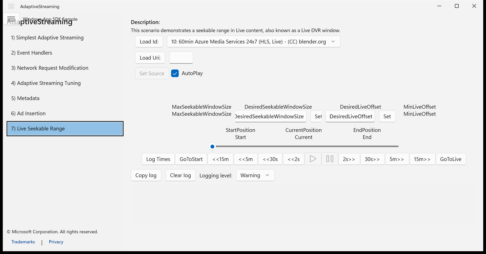

# Migration Score: AdaptiveStreaming

| Metric | Value |
|--------|-------|
| Features evaluated | 17 |
| Pass | 16 |
| Partial | 1 |
| Fail | 0 |
| **Weighted score** | **97.7%** |

---

## Shell / SplitView scenario navigation

**Verdict:** ✅ Pass

MainPage.xaml implements SplitView with ListBox of 7 scenarios, SelectionChanged navigation, blue highlight via ListBoxItem style, and HamburgerButton toggle.

| UWP reference | WinUI 3 result |
|---------------|----------------|
|  |  |

**Expected behaviour checklist:**
- [x] Left pane displays a ListBox with 7 numbered scenario items
- [x] Selecting a scenario item navigates the content frame to the corresponding scenario page
- [x] The selected item is visually highlighted with a blue background
- [x] A hamburger toggle button in the header can collapse/expand the left pane

---

## Shell / App header with title and branding

**Verdict:** ⚠️ Partial

Header displays 'Windows App SDK Sample' text and hamburger button. Footer has copyright, Trademarks and Privacy links. However, no Windows SDK logo image element is present in the header—only a text label. The TitleBar uses AppIcon.ico but not the SDK branding logo.

| UWP reference | WinUI 3 result |
|---------------|----------------|
|  |  |

**Expected behaviour checklist:**
- [ ] Header shows Windows SDK logo image on the left
- [x] Header displays 'Windows App SDK Sample' or 'Universal Windows Platform sample' text
- [x] The left pane shows 'AdaptiveStreaming' as the sample title
- [x] Footer area shows Microsoft copyright, Trademarks and Privacy links

---

## Scenario 1 - Simplest Adaptive Streaming / Load button triggers media playback

**Verdict:** ✅ Pass

Scenario1 XAML has Load button with Click handler and MediaPlayerElement with AreTransportControlsEnabled. Load_Click sets the source URI.

| UWP reference | WinUI 3 result |
|---------------|----------------|
|  |  |

**Expected behaviour checklist:**
- [x] A 'Load' button is displayed below the description text
- [x] Clicking 'Load' sets the MediaPlayerElement source to an adaptive streaming URI
- [x] The MediaPlayerElement shows transport controls (play/pause, seek bar, volume, fullscreen)

---

## Scenario 1 - Simplest Adaptive Streaming / Scenario description text

**Verdict:** ✅ Pass

Scenario1 XAML contains 'Description:' header with SampleHeaderTextStyle and explanatory paragraph text with TextWrapping.

| UWP reference | WinUI 3 result |
|---------------|----------------|
|  |  |

**Expected behaviour checklist:**
- [x] Text 'Description:' appears as a header at the top of the content area
- [x] Descriptive paragraph text wraps and explains the scenario functionality

---

## Content Selector Control / Load by content ID with ComboBox

**Verdict:** ✅ Pass

ContentSelector.xaml has 'Load Id:' button and ComboBox. Code-behind populates ComboBox with AdaptiveContentModel items from ContentManagementSystemStub.

| UWP reference | WinUI 3 result |
|---------------|----------------|
|  |  |

**Expected behaviour checklist:**
- [x] A 'Load Id:' button is displayed
- [x] A ComboBox next to it shows the currently selected content model with its ID and display name
- [x] Clicking 'Load Id:' loads the selected content model's manifest URI
- [x] The ComboBox dropdown lists all available Azure Media Services content items

---

## Content Selector Control / Load by custom URI

**Verdict:** ✅ Pass

ContentSelector.xaml has 'Load Uri:' button and TextBox with InputScope='Url'.

| UWP reference | WinUI 3 result |
|---------------|----------------|
|  |  |

**Expected behaviour checklist:**
- [x] A 'Load Uri:' button is displayed below the Load Id row
- [x] A TextBox input field next to it allows entering a custom URI
- [x] Clicking 'Load Uri:' loads the URI from the TextBox as the media source

---

## Content Selector Control / Set Source button and AutoPlay checkbox

**Verdict:** ✅ Pass

ContentSelector.xaml has 'Set Source' button (IsEnabled='False') and AutoPlay CheckBox with Checked/Unchecked handlers.

| UWP reference | WinUI 3 result |
|---------------|----------------|
|  |  |

**Expected behaviour checklist:**
- [x] A 'Set Source' button is shown, initially disabled (grayed out)
- [x] After successfully loading a URI, 'Set Source' becomes enabled
- [x] An 'AutoPlay' checkbox is displayed next to Set Source
- [x] Checking AutoPlay causes media to play immediately when source is set

---

## Scenario 2 - Event Handlers / Download and playback bitrate indicators

**Verdict:** ✅ Pass

Scenario2 XAML has SymbolIcon(Download), SymbolIcon(ZeroBars) for download bitrate, SymbolIcon(Play), SymbolIcon(ZeroBars) for playback bitrate, with TextBlocks for numeric values. BitrateHelper class handles quartile-based signal bar assignment.

| UWP reference | WinUI 3 result |
|---------------|----------------|
|  |  |

**Expected behaviour checklist:**
- [x] A download icon with a signal bars indicator is displayed
- [x] A play icon with a signal bars indicator is displayed
- [x] Numeric bitrate values appear next to each indicator
- [x] Signal bar icons update to reflect current bitrate quartile (1-4 bars)

---

## Scenario 3 - Request Modification / Authorization method radio buttons

**Verdict:** ✅ Pass

Scenario3 XAML has 4 RadioButtons in AzureAuthorizationMethodPanel: None, Authorization Header (IsChecked=True), Url Query Parameter, Application Downloaded. Mutually exclusive via GroupName='AzureMethod'.

| UWP reference | WinUI 3 result |
|---------------|----------------|
|  |  |

**Expected behaviour checklist:**
- [x] Four radio buttons are displayed in a vertical stack for Azure authorization method
- [x] 'Authorization Header' is selected by default
- [x] Radio buttons are mutually exclusive (selecting one deselects others)
- [x] Options are: None, Authorization Header, Url Query Parameter, Application Downloaded

---

## Scenario 3 - Request Modification / HDCP protection level radio buttons

**Verdict:** ✅ Pass

Scenario3 XAML has 'Desired HDCP minimum protection' text, 3 radio buttons (HDCP Off IsChecked=True, HDCP On, HDCP On With Type Enforcement), and 'Effective protection:' display with Run elements.

| UWP reference | WinUI 3 result |
|---------------|----------------|
|  |  |

**Expected behaviour checklist:**
- [x] A 'Desired HDCP minimum protection' label is shown
- [x] Three radio buttons: HDCP Off (default selected), HDCP On, HDCP On With Type Enforcement
- [x] An 'Effective protection:' text displays the current effective protection level
- [x] Selecting HDCP options updates the effective protection display

---

## Scenario 4 - Adaptive Streaming Tuning / Min/Initial/Max bitrate ComboBoxes

**Verdict:** ✅ Pass

Scenario4 XAML has 'Min Bitrate ≤', 'Initial Bitrate ≤', 'Max Bitrate' labels each with a ComboBox and SelectionChanged handlers.

| UWP reference | WinUI 3 result |
|---------------|----------------|
|  |  |

**Expected behaviour checklist:**
- [x] A 'Min Bitrate ≤' label with a ComboBox is displayed
- [x] An 'Initial Bitrate ≤' label with a ComboBox is displayed
- [x] A 'Max Bitrate' label with a ComboBox is displayed
- [x] ComboBox items are populated with available bitrate values after content loads

---

## Scenario 4 - Adaptive Streaming Tuning / Downgrade ratio and headroom ratio settings

**Verdict:** ✅ Pass

Scenario4 XAML has 'Downgrade ratio:' label, TextBox, and Set button; 'Desired headroom ratio:' label, TextBox, and Set button.

| UWP reference | WinUI 3 result |
|---------------|----------------|
|  |  |

**Expected behaviour checklist:**
- [x] A 'Downgrade ratio:' label with a TextBox and 'Set' button is displayed
- [x] A 'Desired headroom ratio:' label with a TextBox and 'Set' button is displayed
- [x] Clicking 'Set' applies the entered numeric value to the adaptive media source

---

## Scenario 7 - Live Seekable Range / Seekable window size controls

**Verdict:** ✅ Pass

Scenario7 XAML has MaxSeekableWindowSize label+value, DesiredSeekableWindowSize TextBox+Set button, DesiredLiveOffset TextBox+Set button, MinLiveOffset label+value.

| UWP reference | WinUI 3 result |
|---------------|----------------|
|  |  |

**Expected behaviour checklist:**
- [x] MaxSeekableWindowSize label and value text are displayed
- [x] DesiredSeekableWindowSize has a TextBox and 'Set' button
- [x] DesiredLiveOffset has a TextBox and 'Set' button
- [x] MinLiveOffset label and value text are displayed

---

## Scenario 7 - Live Seekable Range / Position slider with start/current/end labels

**Verdict:** ✅ Pass

Scenario7 XAML has StartPosition, CurrentPosition, EndPosition TextBlocks in a Grid with a Slider spanning 3 columns (Width=500, Horizontal).

| UWP reference | WinUI 3 result |
|---------------|----------------|
|  |  |

**Expected behaviour checklist:**
- [x] StartPosition, CurrentPosition, and EndPosition labels are shown
- [x] A horizontal Slider control spans the width below the labels
- [x] Position values update during live playback

---

## Scenario 7 - Live Seekable Range / Discrete seek and transport control buttons

**Verdict:** ✅ Pass

Scenario7 XAML has all buttons: Log Times, GoToStart, <<15m, <<5m, <<30s, <<2s, Play (disabled), Pause (disabled), 2s>>, 30s>>, 5m>>, 15m>>, GoToLive.

| UWP reference | WinUI 3 result |
|---------------|----------------|
|  |  |

**Expected behaviour checklist:**
- [x] A 'Log Times' button is displayed
- [x] A 'GoToStart' button is displayed
- [x] Seek backward buttons: <<15m, <<5m, <<30s, <<2s are displayed
- [x] Play and Pause icon buttons are displayed (initially disabled until media loads)
- [x] Seek forward buttons: 2s>>, 30s>>, 5m>>, 15m>> are displayed
- [x] A 'GoToLive' button is displayed

---

## Logging / Log view with Copy/Clear and logging level

**Verdict:** ✅ Pass

LogView.xaml has 'Copy log' button, 'Clear log' button, 'Logging level:' label with ComboBox (Verbose/Information/Warning/Error/Critical), scrollable ListBox for log messages, and color-coded brush resources for severity levels.

| UWP reference | WinUI 3 result |
|---------------|----------------|
|  |  |

**Expected behaviour checklist:**
- [x] A 'Copy log' button is displayed
- [x] A 'Clear log' button is displayed
- [x] A 'Logging level:' label with a ComboBox is shown, defaulting to 'Warning'
- [x] Log messages appear in the log area with timestamps
- [x] The log area displays colored text for different severity levels

---

## Media Playback / MediaPlayerElement with transport controls

**Verdict:** ✅ Pass

All scenario XAML pages include MediaPlayerElement with AreTransportControlsEnabled='True'. Transport controls provide seek, play/pause, volume, and fullscreen by default.

| UWP reference | WinUI 3 result |
|---------------|----------------|
|  |  |

**Expected behaviour checklist:**
- [x] A MediaPlayerElement occupies the main content area below controls
- [x] Transport controls bar appears at the bottom of the media player
- [x] Transport controls include: seek slider, elapsed time, volume button, play/pause, aspect ratio, and cast/fullscreen buttons
- [x] The player area is empty/black before media is loaded
