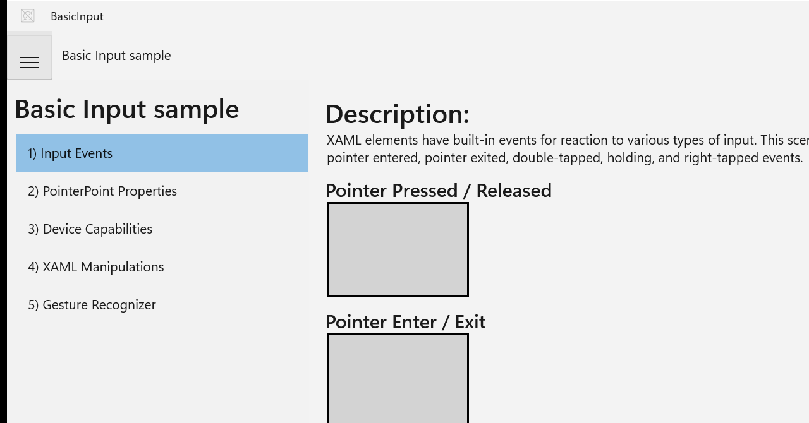
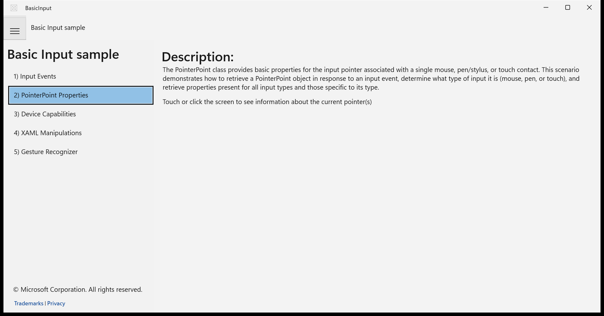
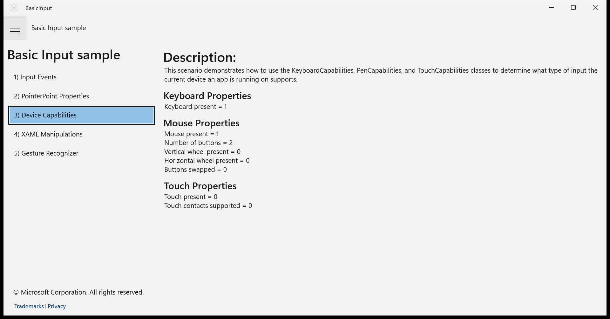
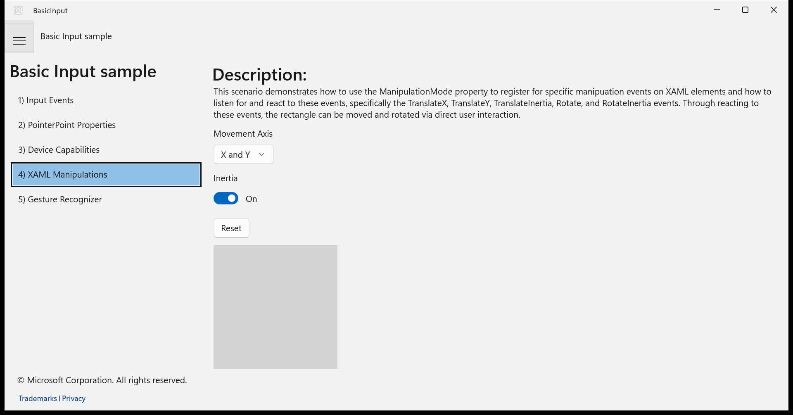
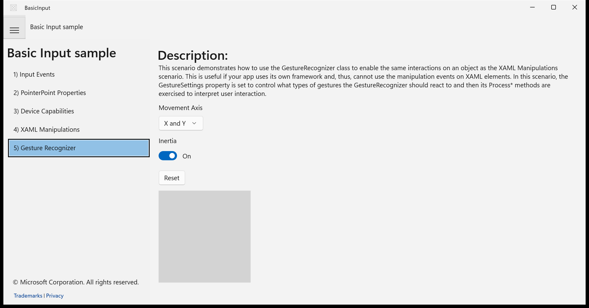

# Migration Score: BasicInput

| Metric | Value |
|--------|-------|
| Features evaluated | 18 |
| Pass | 14 |
| Partial | 4 |
| Fail | 0 |
| **Weighted score** | **88.6%** |

---

## Navigation / Scenario list navigation

**Verdict:** ✅ Pass

All 5 scenarios are listed in a sidebar list on the left. Clicking each scenario loads the corresponding page content. The selected scenario is visually highlighted with a blue background. Confirmed via UIA tree and screenshot.

| UWP reference | WinUI 3 result |
|---------------|----------------|
| *(no UWP capture — app crashed at startup)* |  |

**Expected behaviour checklist:**
- [x] A list with 5 items is visible: 'Input Events', 'PointerPoint Properties', 'Device Capabilities', 'XAML Manipulations', 'Gesture Recognizer'
- [x] Clicking a scenario name loads the corresponding page content in the main area
- [x] The selected scenario is visually highlighted in the list

---

## Scenario 1 – Input Events / Pointer Pressed / Released interaction

**Verdict:** ✅ Pass

A 150×100 bordered rectangle labeled 'Pointer Pressed / Released' is displayed with LightGray background and black border. XAML source confirms PointerPressed/PointerReleased event handlers with RoyalBlue/LightGray color changes matching UWP behavior.

| UWP reference | WinUI 3 result |
|---------------|----------------|
| *(no UWP capture)* |  |

**Expected behaviour checklist:**
- [x] A 150×100 bordered rectangle labeled 'Pointer Pressed / Released' is displayed
- [x] Clicking/pressing the rectangle changes its background to blue and displays 'Pointer Pressed'
- [x] Releasing the pointer reverts the background to light grey and displays 'Pointer Released'

---

## Scenario 1 – Input Events / Pointer Enter / Exit interaction

**Verdict:** ✅ Pass

A 150×100 bordered rectangle labeled 'Pointer Enter / Exit' is displayed. XAML source confirms PointerEntered/PointerExited event handlers. Visible in screenshot.

| UWP reference | WinUI 3 result |
|---------------|----------------|
| *(no UWP capture)* |  |

**Expected behaviour checklist:**
- [x] A 150×100 bordered rectangle labeled 'Pointer Enter / Exit' is displayed
- [x] Moving the pointer into the rectangle changes its background to blue and displays 'Pointer Entered'
- [x] Moving the pointer out of the rectangle reverts the background to light grey and displays 'Pointer Exited'

---

## Scenario 1 – Input Events / Tap / Double-Tap interaction

**Verdict:** ✅ Pass

A 150×100 bordered rectangle labeled 'Tap / Double-Tap' is present (confirmed via UIA text elements). XAML source defines Tapped/DoubleTapped event handlers with correct color changes.

| UWP reference | WinUI 3 result |
|---------------|----------------|
| *(no UWP capture)* |  |

**Expected behaviour checklist:**
- [x] A 150×100 bordered rectangle labeled 'Tap / Double-Tap' is displayed
- [x] Single-clicking the rectangle changes its background to sky blue and displays 'Tapped'
- [x] Double-clicking the rectangle changes its background to royal blue and displays 'Double-Tapped'

---

## Scenario 1 – Input Events / Right-Tap / Press-and-Hold interaction

**Verdict:** ✅ Pass

A 150×100 bordered rectangle labeled 'Right-Tap / Press-and-Hold' is present (confirmed via UIA). XAML source defines RightTapped and Holding event handlers with proper color changes.

| UWP reference | WinUI 3 result |
|---------------|----------------|
| *(no UWP capture)* |  |

**Expected behaviour checklist:**
- [x] A 150×100 bordered rectangle labeled 'Right-Tap / Press-and-Hold' is displayed
- [x] Right-clicking the rectangle changes its background to blue and displays 'Right Tapped'
- [x] Press-and-hold changes background to sky blue and displays 'Holding', then reverts on release with 'Held'

---

## Scenario 2 – PointerPoint Properties / Pointer properties display canvas

**Verdict:** ⚠️ Partial

The canvas area displays with instruction text 'Touch or click the screen to see information about the current pointer(s)'. XAML defines a Canvas for pointer popups. The code handles PointerPressed/Moved/Released to create/update/remove popups. Marked partial because interactive behavior (popup following pointer) cannot be fully verified via static screenshot — the canvas appears empty at rest.

| UWP reference | WinUI 3 result |
|---------------|----------------|
| *(no UWP capture)* |  |

**Expected behaviour checklist:**
- [x] A canvas area is displayed with instruction text 'Touch or click the screen to see information about the current pointer(s)'
- [x] Clicking on the canvas displays a popup near the click position showing pointer ID, X, Y coordinates, and contact state
- [x] The popup follows the pointer while the button/finger is held down
- [x] The popup disappears when the pointer is released

---

## Scenario 2 – PointerPoint Properties / Mouse-specific pointer properties

**Verdict:** ⚠️ Partial

The code-behind handles mouse-specific properties and displays them in red text when a mouse pointer is detected. Cannot verify the red text color or specific property values in a static screenshot since the popup only appears during active interaction, but the code structure is faithful to the UWP original.

| UWP reference | WinUI 3 result |
|---------------|----------------|
| *(no UWP capture)* |  |

**Expected behaviour checklist:**
- [x] Mouse click on the canvas shows additional mouse-specific properties in red text
- [x] Properties include left button, right button, middle button, X1 button, X2 button states, and mouse wheel delta

---

## Scenario 3 – Device Capabilities / Keyboard capabilities display

**Verdict:** ✅ Pass

Screenshot shows 'Keyboard Properties' heading with 'Keyboard present = 1' text below it. Matches expected behavior exactly.

| UWP reference | WinUI 3 result |
|---------------|----------------|
| *(no UWP capture)* |  |

**Expected behaviour checklist:**
- [x] A 'Keyboard Properties' heading is displayed
- [x] Below the heading, text shows 'Keyboard present = 1' (or 0 if no keyboard)

---

## Scenario 3 – Device Capabilities / Mouse capabilities display

**Verdict:** ✅ Pass

Screenshot shows 'Mouse Properties' heading with: Mouse present = 1, Number of buttons = 2, Vertical wheel present = 0, Horizontal wheel present = 0, Buttons swapped = 0.

| UWP reference | WinUI 3 result |
|---------------|----------------|
| *(no UWP capture)* |  |

**Expected behaviour checklist:**
- [x] A 'Mouse Properties' heading is displayed
- [x] Below the heading, text shows mouse present status, number of buttons, vertical wheel present, horizontal wheel present, and buttons swapped status

---

## Scenario 3 – Device Capabilities / Touch capabilities display

**Verdict:** ✅ Pass

Screenshot shows 'Touch Properties' heading with: Touch present = 0, Touch contacts supported = 0. All expected properties are displayed.

| UWP reference | WinUI 3 result |
|---------------|----------------|
| *(no UWP capture)* |  |

**Expected behaviour checklist:**
- [x] A 'Touch Properties' heading is displayed
- [x] Below the heading, text shows touch present status and number of supported touch contacts

---

## Scenario 4 – XAML Manipulations / Rectangle drag and rotate via XAML manipulation events

**Verdict:** ✅ Pass

Screenshot shows a light grey rectangle inside a canvas area. XAML defines ManipulationMode with TranslateX/Y, TranslateInertia, Rotate, RotateInertia. Code-behind handles ManipulationStarted (DeepSkyBlue), ManipulationInertiaStarting (RoyalBlue), and ManipulationCompleted (LightGray).

| UWP reference | WinUI 3 result |
|---------------|----------------|
| *(no UWP capture)* |  |

**Expected behaviour checklist:**
- [x] A 200×200 light grey bordered rectangle is displayed inside a canvas area
- [x] Dragging the rectangle moves it across the canvas
- [x] The rectangle changes to blue during active manipulation
- [x] The rectangle reverts to light grey when manipulation completes

---

## Scenario 4 – XAML Manipulations / Movement axis ComboBox control

**Verdict:** ✅ Pass

UIA confirms a ComboBox named 'Movement Axis' is present. Screenshot shows 'X and Y' selected as default. XAML source defines three ComboBoxItem options.

| UWP reference | WinUI 3 result |
|---------------|----------------|
| *(no UWP capture)* |  |

**Expected behaviour checklist:**
- [x] A ComboBox labeled 'Movement Axis' is visible with 'X and Y' selected by default
- [x] Dropdown contains three options: 'X and Y', 'X only', 'Y only'
- [x] Selecting 'X only' restricts rectangle dragging to horizontal movement only
- [x] Selecting 'Y only' restricts rectangle dragging to vertical movement only

---

## Scenario 4 – XAML Manipulations / Inertia ToggleSwitch

**Verdict:** ⚠️ Partial

UIA shows the ToggleSwitch as a Button named 'Inertia'. Screenshot shows it in 'On' state with blue toggle. Visually correct but UIA automation type difference from a proper ToggleSwitch may indicate a minor accessibility concern.

| UWP reference | WinUI 3 result |
|---------------|----------------|
| *(no UWP capture)* |  |

**Expected behaviour checklist:**
- [x] A ToggleSwitch labeled 'Inertia' is displayed and is on by default
- [x] Toggling it off disables inertia — the rectangle stops immediately when released
- [x] Toggling it on re-enables inertia — the rectangle glides after release

---

## Scenario 4 – XAML Manipulations / Reset button

**Verdict:** ✅ Pass

UIA confirms a Button named 'Reset' is present. Code-behind resets rectangle position, ComboBox to 'X and Y', and Inertia toggle to on.

| UWP reference | WinUI 3 result |
|---------------|----------------|
| *(no UWP capture)* |  |

**Expected behaviour checklist:**
- [x] A button labeled 'Reset' is visible
- [x] Clicking Reset moves the rectangle back to its original position
- [x] The Movement Axis ComboBox resets to 'X and Y'
- [x] The Inertia toggle resets to on

---

## Scenario 5 – Gesture Recognizer / Rectangle drag and rotate via GestureRecognizer

**Verdict:** ✅ Pass

Screenshot shows a light grey rectangle inside a canvas area, identical layout to Scenario 4. Code-behind uses GestureRecognizer with ProcessDownEvent/ProcessMoveEvents/ProcessUpEvent and correct color change handlers.

| UWP reference | WinUI 3 result |
|---------------|----------------|
| *(no UWP capture)* |  |

**Expected behaviour checklist:**
- [x] A 200×200 light grey bordered rectangle is displayed inside a canvas area
- [x] Dragging the rectangle moves it across the canvas
- [x] The rectangle changes to blue during active manipulation
- [x] The rectangle reverts to light grey when manipulation completes

---

## Scenario 5 – Gesture Recognizer / GestureRecognizer movement axis ComboBox

**Verdict:** ✅ Pass

UIA confirms a ComboBox named 'Movement Axis' with 'X and Y' default. Code-behind modifies GestureSettings to restrict drag axes.

| UWP reference | WinUI 3 result |
|---------------|----------------|
| *(no UWP capture)* |  |

**Expected behaviour checklist:**
- [x] A ComboBox labeled 'Movement Axis' is visible with 'X and Y' selected by default
- [x] Dropdown contains three options: 'X and Y', 'X only', 'Y only'
- [x] Selecting 'X only' restricts movement to horizontal only
- [x] Selecting 'Y only' restricts movement to vertical only

---

## Scenario 5 – Gesture Recognizer / GestureRecognizer inertia ToggleSwitch

**Verdict:** ⚠️ Partial

UIA shows the ToggleSwitch as a Button named 'Inertia'. Screenshot shows it in 'On' state. Same note as Scenario 4 — visually correct but UIA type difference.

| UWP reference | WinUI 3 result |
|---------------|----------------|
| *(no UWP capture)* |  |

**Expected behaviour checklist:**
- [x] A ToggleSwitch labeled 'Inertia' is displayed and is on by default
- [x] Toggling it off disables inertia
- [x] Toggling it on re-enables inertia

---

## Scenario 5 – Gesture Recognizer / GestureRecognizer reset button

**Verdict:** ✅ Pass

UIA confirms a Button named 'Reset' is present. Code-behind resets rectangle position, ComboBox, Inertia toggle, and reinitializes GestureRecognizer settings.

| UWP reference | WinUI 3 result |
|---------------|----------------|
| *(no UWP capture)* |  |

**Expected behaviour checklist:**
- [x] A button labeled 'Reset' is visible
- [x] Clicking Reset moves the rectangle back to its original position
- [x] The Movement Axis ComboBox resets to 'X and Y'
- [x] The Inertia toggle resets to on
