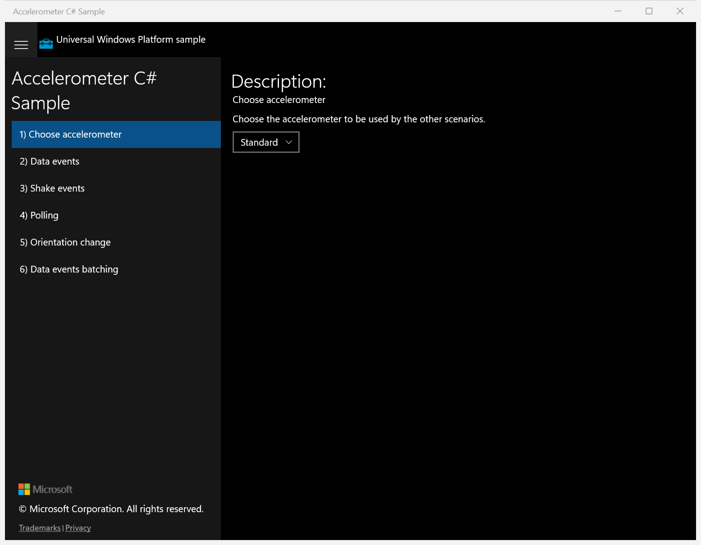
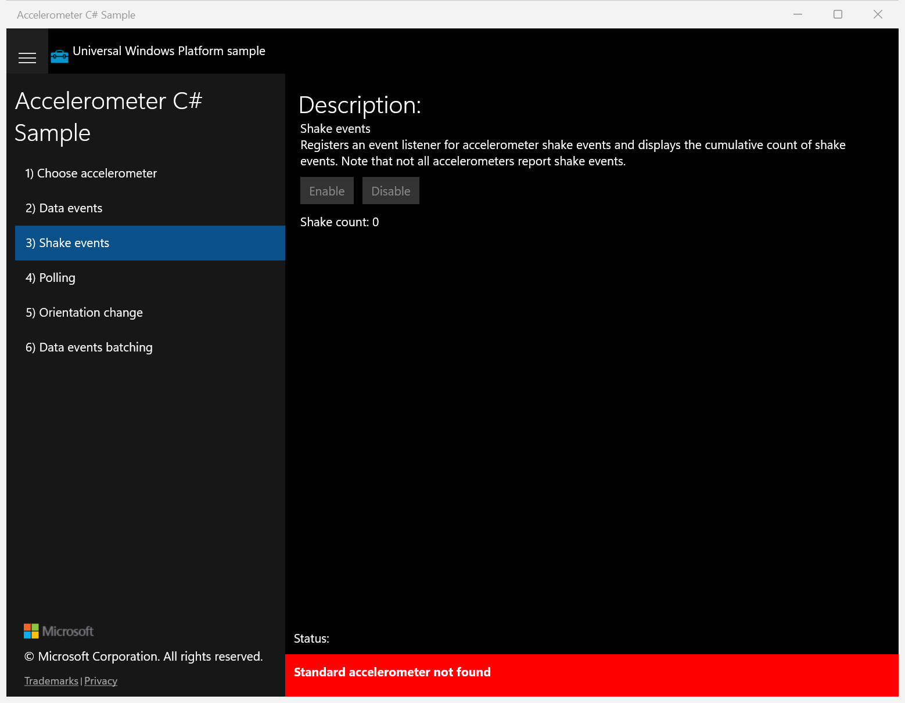
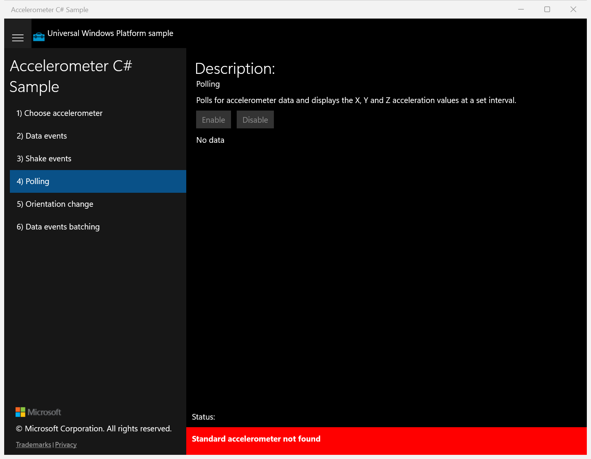
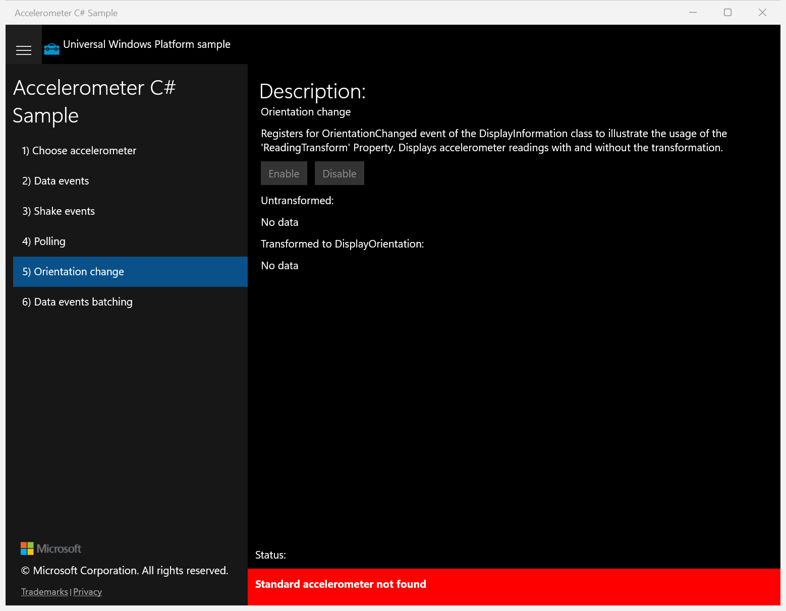
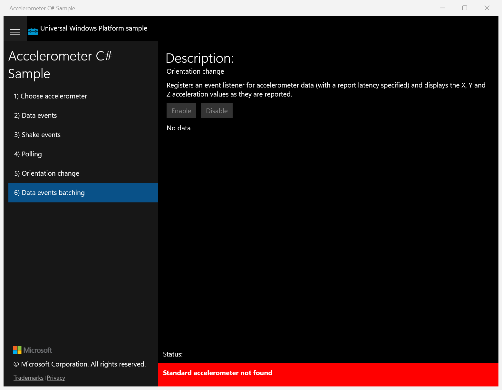

# UWP Rubric — Accelerometer C# Sample

Ground-truth feature rubric derived from the **running original UWP app** (launched via
`uwp-app-runner`, PID 30032, window "Accelerometer C# Sample") plus the source-derived
checklist. UWP capture status: **ok** (6/6 scenarios captured).

> Environment note: this machine has **no accelerometer**, so sensor-driven output reads
> "No data" and the status bar reads "Standard accelerometer not found" in the original
> UWP app. That is the ground truth the WinUI 3 candidate is scored against.

## Scenario 1 / Choose accelerometer

**ID:** `choose-accelerometer`
**Weight:** 2

Lets the user pick which accelerometer is used by the other scenarios via a ComboBox.

**Expected behaviour:**
- A 'Standard' selection ComboBox is shown under the description text.
- Description reads 'Choose the accelerometer to be used by the other scenarios.'

**UWP reference screenshot:**

## Scenario 2 / Data events

**ID:** `data-events`
**Weight:** 1

Registers a ReadingChanged handler and displays X/Y/Z acceleration. Enable/Disable control the subscription.

**Expected behaviour:**
- Enable and Disable buttons are present.
- Output region shows acceleration values (or 'No data' / not-found status with no sensor).

**UWP reference screenshot:**

## Scenario 3 / Shake events

**ID:** `shake-events`
**Weight:** 1

Registers a Shaken handler and shows a cumulative shake count.

**Expected behaviour:**
- Enable and Disable buttons are present.
- Shows 'Shake count: 0' and a status line ('Standard accelerometer not found' when no sensor).

**UWP reference screenshot:**

## Scenario 4 / Polling

**ID:** `polling`
**Weight:** 1

Polls the accelerometer at a set interval and displays X/Y/Z values.

**Expected behaviour:**
- Enable and Disable buttons are present.
- Output shows 'No data' until polling produces readings; status line shown.

**UWP reference screenshot:**

## Scenario 5 / Orientation change

**ID:** `orientation-change`
**Weight:** 2

Uses the ReadingTransform property to show readings with and without display-orientation transformation.

**Expected behaviour:**
- Enable and Disable buttons are present (disabled when no sensor).
- Shows 'Untransformed:' and 'Transformed to DisplayOrientation:' sections, each 'No data' without a sensor.
- Red status bar reads 'Standard accelerometer not found' when no sensor present.

**UWP reference screenshot:**

## Scenario 6 / Data events batching

**ID:** `data-events-batching`
**Weight:** 1

Registers a ReadingChanged handler with a report-latency (batching) and displays X/Y/Z values.

**Expected behaviour:**
- Enable and Disable buttons are present.
- Output shows acceleration values / 'No data' and a status line.

**UWP reference screenshot:**

---

RUBRIC COMPLETE: 6 features written to notes\rubric.json
