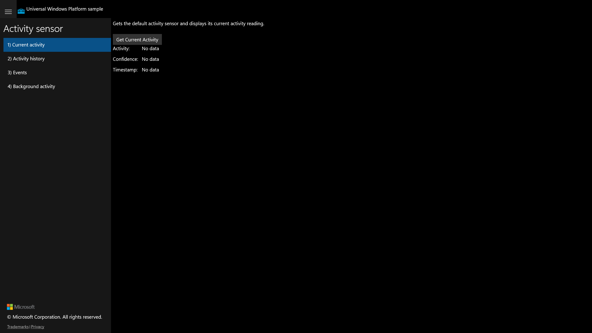

# Feature Rubric — ActivitySensor

Scenario: **ActivitySensor**
UWP capture status: **partial** — the original UWP app launched and rendered (golden
screenshot captured for the default scenario). Live per-scenario UIA navigation/actuation
of the UWP app was unavailable on this host (CoreWindow UIA not exposed through
ApplicationFrameHost; foreground activation blocked), so scenarios 2–4 reuse the launch
frame and no UWP behavioural baseline was captured.

## Scenario 1 / Current activity

**ID:** `current-activity`
**Weight:** 2

Gets the default ActivitySensor and displays its current activity reading (Activity,
Confidence, Timestamp). On a machine with no activity sensor the page shows
"No activity sensor found".

**Expected behaviour:**
- Scenario page exposes a "Get Current Activity" button
- Three labelled outputs are present: Activity, Confidence, Timestamp (default "No data")
- When no sensor is present a status of "No activity sensor found" is shown

**UWP reference screenshot:**

## Scenario 2 / Activity history

**ID:** `activity-history`
**Weight:** 1

Reads the device's recorded activity history over a time range and displays the entries.

**Expected behaviour:**
- Scenario page exposes a "Get Activity History" button
- Invoking the button produces a status/output response

_UWP screenshot not captured (live UWP per-scenario navigation unavailable on this host)._

## Scenario 3 / Events (ReadingChanged)

**ID:** `change-events`
**Weight:** 1

Subscribes/unsubscribes to the ActivitySensor ReadingChanged event. "ReadingChanged On"
enables the subscription; "ReadingChanged Off" disables it (disabled until On is pressed).

**Expected behaviour:**
- Scenario page exposes both "ReadingChanged On" and "ReadingChanged Off" buttons
- "ReadingChanged Off" is initially disabled and only enables after "ReadingChanged On"
- Invoking "ReadingChanged On" produces a visible status response

_UWP screenshot not captured (live UWP per-scenario navigation unavailable on this host)._

## Scenario 4 / Background activity

**ID:** `background-activity`
**Weight:** 1

Registers/unregisters a background task for activity updates. "Register Task" registers it;
"Unregister Task" is disabled until a task is registered.

**Expected behaviour:**
- Scenario page exposes both "Register Task" and "Unregister Task" buttons
- "Unregister Task" is initially disabled and only enables after "Register Task"
- Invoking "Register Task" produces a visible status response

_UWP screenshot not captured (live UWP per-scenario navigation unavailable on this host)._
