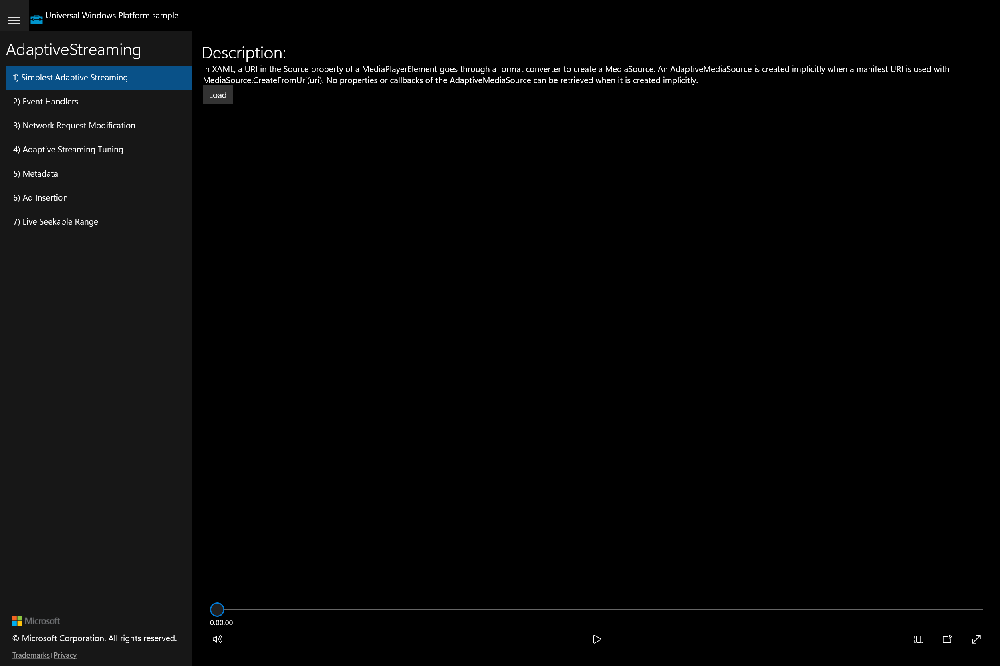

# UWP Feature Rubric — AdaptiveStreaming

**Scenario:** AdaptiveStreaming
**UWP capture status:** partial — the original UWP app launched (uwp-app-runner `ok:true`, windowTitle `AdaptiveStreaming sample`, pid 17368) and its default landing scenario was screenshotted, but per-scenario navigation/actuation of the original UWP was not possible (the UWP CoreWindow's XAML UIA tree is not projected to winapp — only a top-level Pane is visible, search returns 0 controls — and this is a non-interactive desktop session, so SendInput mouse navigation does not work either). Only scenario 1 has a faithful UWP golden frame.

## AdaptiveStreaming scenarios / Simplest Adaptive Streaming

**ID:** `scenario-1-simplest`
**Weight:** 2

A MediaPlayerElement plus a Load button; loading a manifest URI implicitly creates an AdaptiveMediaSource and begins playback.

**Expected behaviour:**
- A MediaPlayerElement (with transport controls) is shown
- A 'Load' button is present and sets the player source when clicked
- Description text describing implicit AdaptiveMediaSource creation is visible

**UWP reference screenshot:**

## AdaptiveStreaming scenarios / Event Handlers

**ID:** `scenario-2-event-handlers`
**Weight:** 1

Explicit AdaptiveMediaSource creation with all adaptive-streaming/playback events logged.

**Expected behaviour:**
- MediaPlayerElement with transport controls is present
- Load Id / Load Uri / Set Source controls and AutoPlay checkbox are present
- A logging list box exists to receive pipeline events
- Bitrate readout text elements (download/playback) are present

**UWP reference screenshot:**
_UWP screenshot not captured (UWP per-scenario navigation unavailable; only default scenario reachable)._

## AdaptiveStreaming scenarios / Network Request Modification

**ID:** `scenario-3-network-request-modification`
**Weight:** 1

Radio buttons select request-modification mode and HDCP policy.

**Expected behaviour:**
- Seven radio buttons present (4 request-modification + 3 HDCP)
- Selecting a radio changes the active mode
- MediaPlayerElement and Load/Set Source controls present

**UWP reference screenshot:**
_UWP screenshot not captured (UWP per-scenario navigation unavailable)._

## AdaptiveStreaming scenarios / Adaptive Streaming Tuning

**ID:** `scenario-4-tuning`
**Weight:** 1

Bitrate combo boxes plus ratio text boxes with Set buttons.

**Expected behaviour:**
- Three bitrate ComboBoxes present
- Two ratio TextBoxes each with an adjacent 'Set' button, editable
- Clicking 'Set' applies the typed ratio
- MediaPlayerElement and Load/Set Source controls present

**UWP reference screenshot:**
_UWP screenshot not captured (UWP per-scenario navigation unavailable)._

## AdaptiveStreaming scenarios / Metadata

**ID:** `scenario-5-metadata`
**Weight:** 1

Consuming/creating timed metadata (ID3, m3u8 comments, emsg).

**Expected behaviour:**
- MediaPlayerElement with transport controls present
- Load Id / Load Uri / Set Source / AutoPlay controls present
- A logging list box exists to receive timed-metadata events

**UWP reference screenshot:**
_UWP screenshot not captured (UWP per-scenario navigation unavailable)._

## AdaptiveStreaming scenarios / Ad Insertion

**ID:** `scenario-6-ad-insertion`
**Weight:** 1

Pre/mid/post-roll ad insertion with playback-progress reporting.

**Expected behaviour:**
- MediaPlayerElement with transport controls present
- Load Id / Load Uri / Set Source / AutoPlay controls present
- A logging list box exists to receive playback-progress events

**UWP reference screenshot:**
_UWP screenshot not captured (UWP per-scenario navigation unavailable)._

## AdaptiveStreaming scenarios / Live Seekable Range

**ID:** `scenario-7-live-seekable-range`
**Weight:** 2

Live playback controls, relative-seek buttons, and live/start navigation.

**Expected behaviour:**
- MediaPlayerElement and Load/Set Source controls present
- DesiredSeekableWindowSize and DesiredLiveOffset text boxes each with a Set button
- Eight relative-seek buttons (<<15m .. 15m>>) present
- Play, Pause, GoToStart, GoToLive, Log Times buttons and a position slider present

**UWP reference screenshot:**
_UWP screenshot not captured (UWP per-scenario navigation unavailable)._
