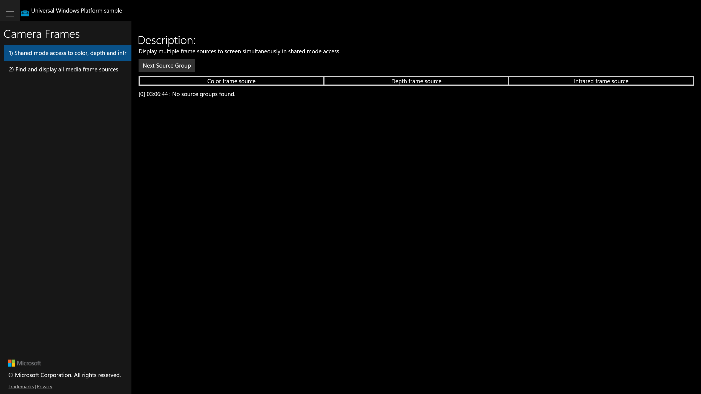

# Feature Rubric — CameraFrames (UWP ground truth)

**UWP capture status:** partial — the original UWP app launched successfully
(`uwp-app-runner` `ok:true`, pid 30324, window "Camera Frames C# Sample") and a golden
screenshot was captured. The UWP CoreWindow exposes only a single `Pane` to UI Automation
(it is hosted by `ApplicationFrameHost`), so title-driven navigation to scenario 2 and
per-control actuation could not be driven on the original app. There is no camera on this
machine, so the app reports "No source groups found."

## Scenario 1 / Shared mode access to color, depth and infrared frame sources

**ID:** `scenario1-shared-mode`
**Weight:** 2

Displays color, depth and infrared frame sources simultaneously in shared mode, with a
"Next Source Group" button to cycle source groups and a status log.

**Expected behaviour:**
- Description block and a "Next Source Group" button are shown
- Three labelled preview regions: Color frame source, Depth frame source, Infrared frame source
- A status/log line reports source-group state (e.g. "No source groups found.")
- Clicking "Next Source Group" cycles the active source group

**UWP reference screenshot:**

## Scenario 2 / Find and display all media frame sources

**ID:** `scenario2-find-display-sources`
**Weight:** 2

Enumerates frame sources and initializes a selected source via a frame reader. Provides
Source Group, Frame Source and Media Format selectors plus Start/Stop controls.

**Expected behaviour:**
- Description block is shown
- Three ComboBoxes: Source Group, Frame Source, Media Format
- Start and Stop buttons present
- Start/Stop disabled until a valid source group/source is selected (hardware-gated)

**UWP reference screenshot:**
_UWP scenario-2 view not separately captured — opaque CoreWindow prevented title-nav; the
golden frame reflects the launch (scenario 1) state._
