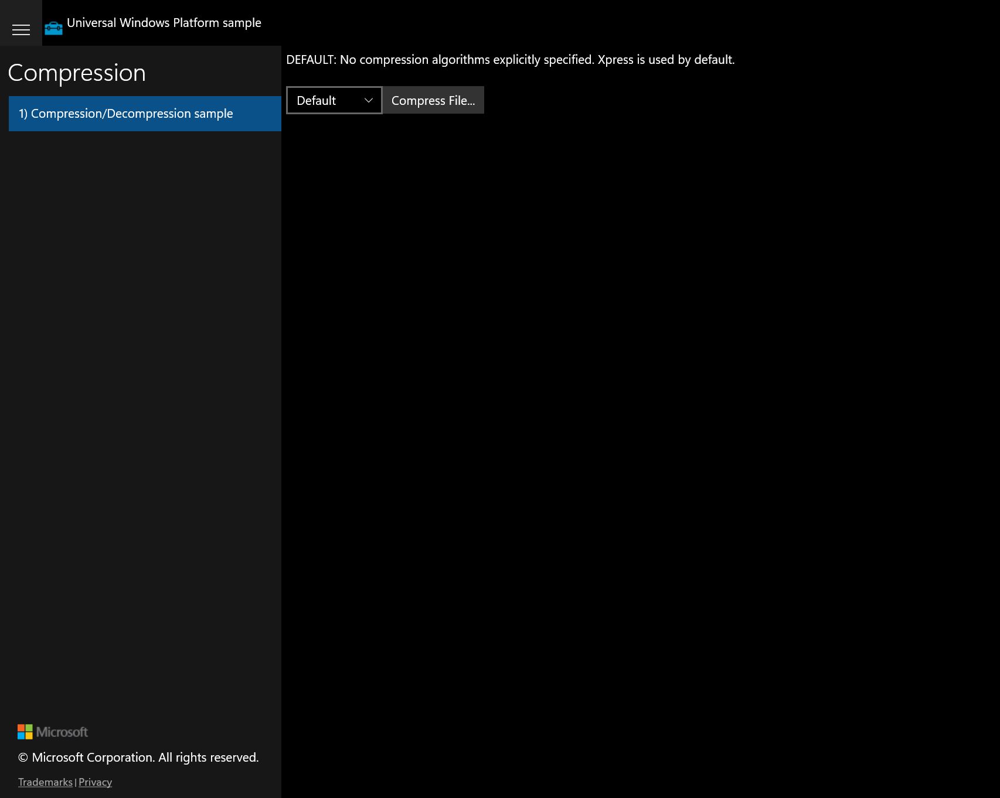

# Feature Rubric — Compression

Ground-truth rubric derived from the original UWP app (`Samples/Compression/cs`),
captured live via `uwp-app-runner` (Release, PID 33272, window "Compression C# Sample").
UWP capture status: **ok**.

## Shell / Scenario list + sample title

**ID:** `scenario-navigation`
**Weight:** 1

The app shows the 'Compression' sample title and a scenario list containing
'1) Compression/Decompression sample', selected on launch.

**Expected behaviour:**
- Header/title reads 'Compression'
- Scenario list contains '1) Compression/Decompression sample'
- That scenario is selected and its page is shown on launch

**UWP reference screenshot:**

## Scenario 1 / Default algorithm description on load

**ID:** `default-description`
**Weight:** 1

On load the DefaultTextBlock is visible ("DEFAULT: No compression algorithms explicitly
specified. Xpress is used by default."); other algorithm descriptions are collapsed.

**Expected behaviour:**
- The DEFAULT description text is visible on initial load
- Xpress/XpressHuff/Mszip/Lzms descriptions are collapsed initially

**UWP reference screenshot:**

## Scenario 1 / Algorithm ComboBox

**ID:** `algorithm-combobox`
**Weight:** 2

A ComboBox (CompressAlgorithmComboBox) offers Default, Xpress, XpressHuff, Mszip, Lzms,
with 'Default' selected (SelectedIndex=0).

**Expected behaviour:**
- ComboBox shows 'Default' selected on load
- Opening it lists Default, Xpress, XpressHuff, Mszip, Lzms

**UWP reference screenshot:**

## Scenario 1 / Description switches with algorithm selection

**ID:** `algorithm-description-switch`
**Weight:** 2

SelectionChanged shows the description TextBlock for the newly selected algorithm and
collapses the previously selected one.

**Expected behaviour:**
- Selecting 'Xpress' shows the XPRESS description and hides the DEFAULT one
- Each algorithm selection reveals only its matching description text

_UWP screenshot not captured (automated capture takes the initial state only; the
per-selection description change was not separately captured)._

## Scenario 1 / Compress File... button opens file picker

**ID:** `compress-file-button`
**Weight:** 2

Clicking 'Compress File...' invokes DoScenario, opening a FileOpenPicker (all types).

**Expected behaviour:**
- A 'Compress File...' button is present next to the ComboBox
- Clicking it opens a single-file open picker with a '*' (All files) filter

**UWP reference screenshot:**

## Scenario 1 / Compress + decompress with progress log

**ID:** `compress-decompress-progress`
**Weight:** 2

After a file is picked, the app compresses it with the selected algorithm, then
decompresses it, logging each step into the Progress TextBlock.

**Expected behaviour:**
- Progress reports the picked file name
- Progress reports compressed and decompressed byte counts
- Progress log matches the UWP message sequence

_UWP screenshot not captured (requires selecting a real file through the picker; not
exercised end-to-end during automated capture)._

## Shell / Status bar notifications

**ID:** `status-notification`
**Weight:** 1

The shared status area (NotifyUser) shows 'Working...' during the operation and
'All done' on success, or an error message on failure.

**Expected behaviour:**
- Status shows 'Working...' when the operation starts
- Status shows 'All done' after success
- Errors (e.g. cancelled picker) surface as an error status message

_UWP screenshot not captured (transient status state; not separately captured)._

---

RUBRIC COMPLETE: 7 features written to notes\rubric.json
