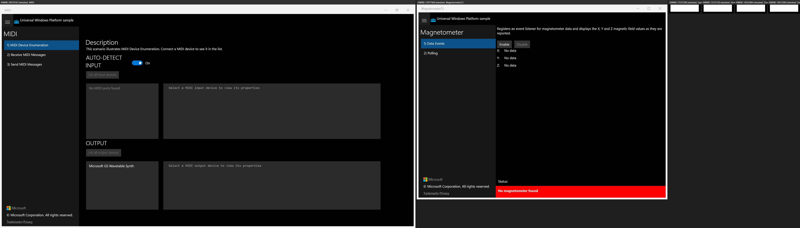
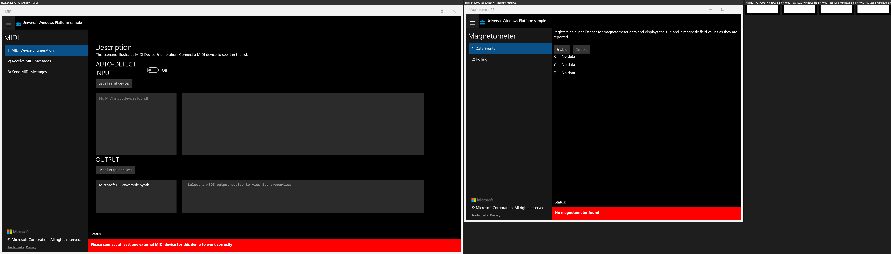
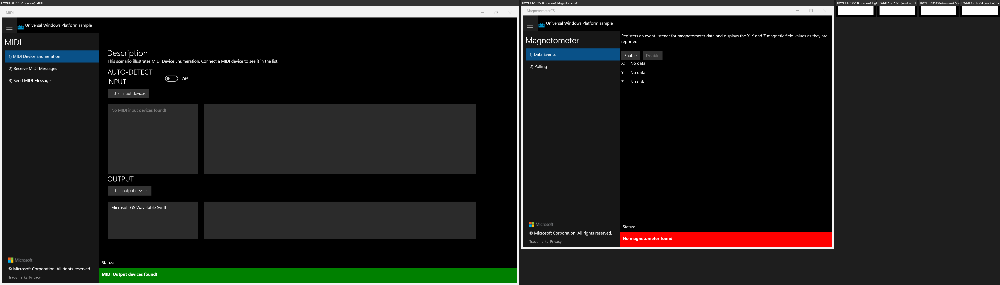
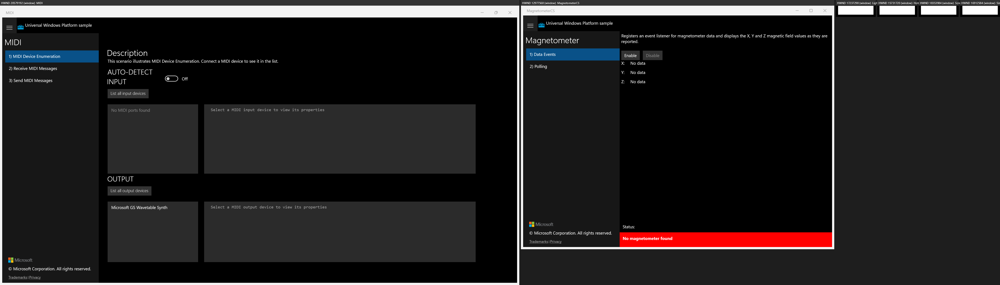
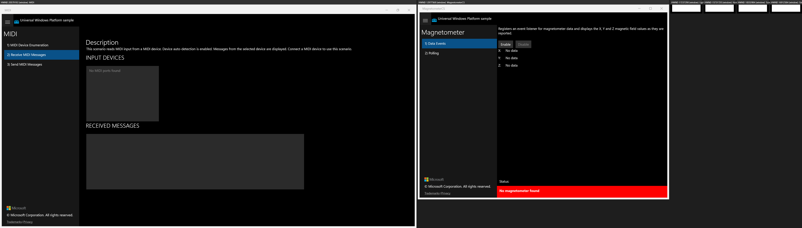
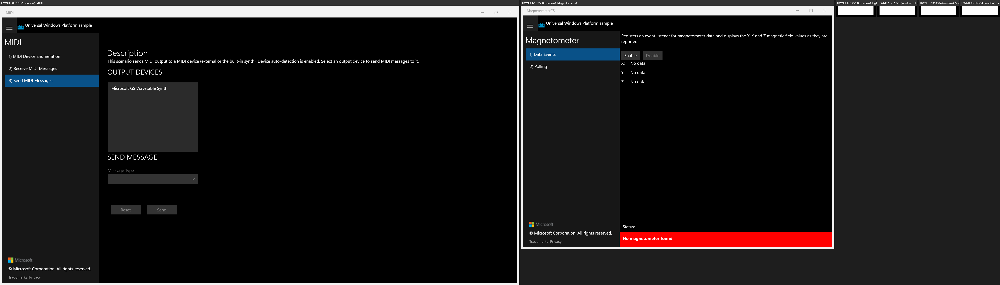

# UWP Feature Rubric — MIDI

**Scenario:** MIDI
**Created:** 2026-07-07T12:04:00+08:00
**UWP capture status:** ok (original UWP app launched via uwp-app-runner, PID 21380, window "MIDI")

The original UWP app was built (Release), launched, and each scenario captured +
actuated. Screenshots referenced below are real files under
`parity/baseline/screenshots/`.

## Scenario 1 - MIDI Device Enumeration / Device enumeration page renders

**ID:** `s1-device-enumeration-page`
**Weight:** 2

Shows MIDI title, description, AUTO-DETECT INPUT toggle (default Off), 'List all input
devices' button, input list, OUTPUT section with 'List all output devices' button,
output list, and a status area.

**Expected behaviour:**
- AUTO-DETECT INPUT toggle present, defaults Off
- Both list buttons present
- Input list shows 'No MIDI input devices found!' with no hardware
- Red status banner 'Please connect at least one external MIDI device...'

**UWP reference screenshot:**

## Scenario 1 - MIDI Device Enumeration / List all input devices button

**ID:** `s1-list-input-devices`
**Weight:** 1

Clicking 'List all input devices' enumerates input ports and updates the list/status.

**Expected behaviour:**
- Clicking produces a visible change in the input list / status text

**UWP reference screenshot:**

## Scenario 1 - MIDI Device Enumeration / List all output devices button

**ID:** `s1-list-output-devices`
**Weight:** 1

Clicking 'List all output devices' lists output ports; the built-in 'Microsoft GS
Wavetable Synth' appears.

**Expected behaviour:**
- Output list contains at least 'Microsoft GS Wavetable Synth'

**UWP reference screenshot:**

## Scenario 1 - MIDI Device Enumeration / Auto-detect input toggle

**ID:** `s1-auto-detect-toggle`
**Weight:** 1

The AUTO-DETECT INPUT ToggleSwitch enables/disables the device watcher. With no MIDI
hardware, toggling is a visible no-op (same in UWP and WinUI).

**Expected behaviour:**
- Toggle interactive; visual state changes
- No new device text with no hardware (parity no-op)

**UWP reference screenshot:**

## Scenario 2 - Receive MIDI Messages / Receive messages page renders

**ID:** `s2-receive-page`
**Weight:** 2

Shows description, INPUT DEVICES list ('No MIDI ports found' with no hardware), and a
RECEIVED MESSAGES list.

**Expected behaviour:**
- INPUT DEVICES section present, shows 'No MIDI ports found' with no hardware
- RECEIVED MESSAGES section present

**UWP reference screenshot:**

## Scenario 3 - Send MIDI Messages / Send messages page renders

**ID:** `s3-send-page`
**Weight:** 2

Shows description, OUTPUT DEVICES list ('Microsoft GS Wavetable Synth'), SEND MESSAGE
header, Message Type combo (disabled until output device selected), Reset/Send buttons
(disabled until valid).

**Expected behaviour:**
- OUTPUT DEVICES list shows 'Microsoft GS Wavetable Synth'
- SEND MESSAGE header and Message Type combo present
- Reset/Send present but disabled until output device + message type chosen

**UWP reference screenshot:**

## Scenario 3 - Send MIDI Messages / Message parameter controls (dynamic)

**ID:** `s3-parameter-controls`
**Weight:** 1

Parameter 1/2/3 combos and the SysEx TextBox are `Visibility="Collapsed"` by default and
only appear after a message type is selected (hardware-gated). Identical XAML in UWP
source and migrated app.

**Expected behaviour:**
- Controls exist in XAML, collapsed by default
- Reveal only after a message type is chosen (not observable without MIDI hardware)

**UWP reference screenshot:**

## Scenario 3 - Send MIDI Messages / Send / Reset buttons

**ID:** `s3-send-reset`
**Weight:** 1

Send/Reset actuate MIDI sending; disabled (dead) until an output device + message type
are selected. Non-responsive in the UWP golden too (hardware-gated).

**Expected behaviour:**
- Buttons present
- Non-responsive with no output device/message type (parity with UWP golden)

**UWP reference screenshot:**

---

RUBRIC COMPLETE: 8 features written to notes\rubric.json
