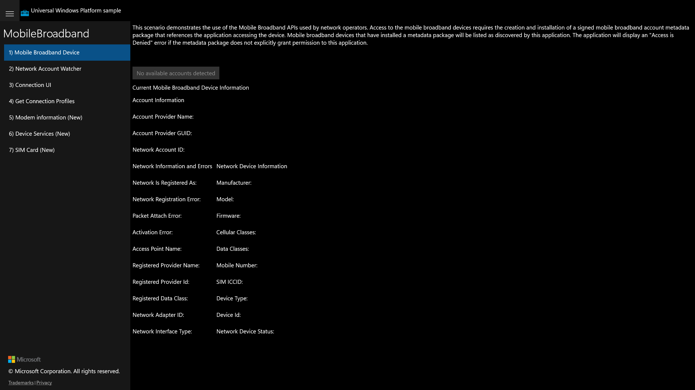

# UWP Feature Rubric — MobileBroadband

**UWP capture status:** partial. The original UWP app launched (Release, pid 34936,
windowTitle `MobileBroadband`) and rendered its full dark-themed UI, but its CoreWindow
exposed **no child UIA elements** to external automation (`winapp ui inspect`/`search`
returned only a top-level Pane, 0 interactive elements). Title-driven navigation could
therefore not switch scenarios, so only the initial frame (Scenario 1) is a true
per-scenario golden; screenshots 02–07 are the same initial frame.

## Scenario 1 / Mobile Broadband Device
**ID:** `mobile-broadband-device`
**Weight:** 2

Shows current mobile broadband device + account information; account picker button.

**Expected behaviour:**
- Page renders a device/account information panel with labeled fields.
- A "No available accounts detected" account selector is visible.
- Content is visibly painted (dark theme, white text) matching the UWP sample.

**UWP reference screenshot:**

## Scenario 2 / Network Account Watcher
**ID:** `network-account-watcher`
**Weight:** 1

Start/Stop a network account watcher and display device information events.

**Expected behaviour:**
- Start and Stop buttons are visible and enabled.
- Clicking Start begins watching and updates status text.
- Clicking Stop halts the watcher.

**UWP reference screenshot:** _same as initial frame (nav not drivable via UIA)._

## Scenario 3 / Connection UI
**ID:** `connection-ui`
**Weight:** 1

Requests the system connection UI for the mobile broadband account.

**Expected behaviour:**
- A control to trigger the connection UI is visible.
- Invoking it attempts to show connection UI / status text.

**UWP reference screenshot:** _same as initial frame (nav not drivable via UIA)._

## Scenario 4 / Get Connection Profiles
**ID:** `get-connection-profiles`
**Weight:** 1

Enumerates mobile broadband connection profiles.

**Expected behaviour:**
- "Get Connection Profiles" button is visible.
- Invoking it lists available profiles or a status message.

**UWP reference screenshot:** _same as initial frame (nav not drivable via UIA)._

## Scenario 5 / Modem information (New)
**ID:** `modem-information`
**Weight:** 1

Refreshes and displays modem information.

**Expected behaviour:**
- "Refresh Modem Information" button is visible.
- Invoking it populates modem info fields or a status message.

**UWP reference screenshot:** _same as initial frame (nav not drivable via UIA)._

## Scenario 6 / Device Services (New)
**ID:** `device-services`
**Weight:** 1

Queries mobile broadband device services.

**Expected behaviour:**
- "Get DeviceService" button is visible.
- Invoking it lists device services or a status message.

**UWP reference screenshot:** _same as initial frame (nav not drivable via UIA)._

## Scenario 7 / SIM Card (New)
**ID:** `sim-card`
**Weight:** 1

Reads SIM card information and ICCID record.

**Expected behaviour:**
- "Get SIM Card Information" and "Get Iccid Record Information" buttons are visible.
- Invoking "Get SIM Card Information" populates SIM fields or a status message.
- "Get Iccid Record Information" becomes usable after SIM info is retrieved.

**UWP reference screenshot:** _same as initial frame (nav not drivable via UIA)._

---
RUBRIC COMPLETE: 7 features written to notes\rubric.json
