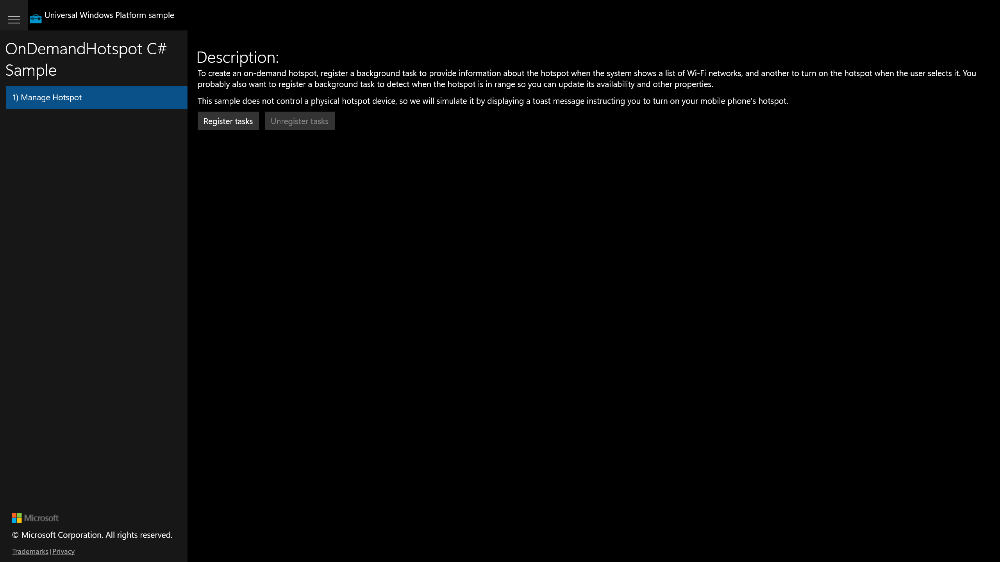

# UWP Rubric — OnDemandHotspot

**Scenario:** OnDemandHotspot
**UWP capture status:** partial — a visual golden of scenario 1 was captured from the live
UWP app, but the UWP CoreWindow (hosted by `ApplicationFrameHost`) exposed no UIA subtree,
so individual controls could not be actuated (all `winapp ui invoke` calls returned
`invokeOk:false`). The post-registration property controls are not visible in the initial
frame, so only the Register/Unregister state was photographed.

## Manage Hotspot / Register / Unregister background tasks

**ID:** `manage-hotspot-register`
**Weight:** 2

The scenario page shows a Description block and two buttons: **Register tasks** (enabled)
and **Unregister tasks** (disabled until registered). Registering wires up the on-demand
hotspot background tasks and reveals the hotspot property editor.

**Expected behaviour:**
- Page renders a Description paragraph explaining the on-demand hotspot sample
- 'Register tasks' button is present and enabled
- 'Unregister tasks' button is present and initially disabled
- Clicking 'Register tasks' enables 'Unregister tasks' and exposes the hotspot property controls

**UWP reference screenshot:**

## Manage Hotspot / Hotspot property editor

**ID:** `manage-hotspot-properties`
**Weight:** 1

After registering, the page presents controls to edit the simulated hotspot: DisplayNameText,
AvailableToggle, CellularBarsToggle + CellularBarsSlider, BatteryPercentageToggle +
BatteryPercentageSlider, SsidText, PasswordText, and 'Update now' / 'Update when user opens
Wi-Fi network list' buttons, plus a status area.

**Expected behaviour:**
- Text box for hotspot display name is present
- AvailableToggle, CellularBarsToggle, BatteryPercentageToggle switches are present
- CellularBarsSlider and BatteryPercentageSlider are present
- SsidText textbox and PasswordText passwordbox are present
- 'Update now' and 'Update when user opens Wi-Fi network list' buttons are present
- Status text block reflects the result of update actions

**UWP reference screenshot:**
_UWP screenshot not captured (post-registration controls not reachable — CoreWindow exposed no UIA subtree to actuate 'Register tasks')._

RUBRIC COMPLETE: 2 features
