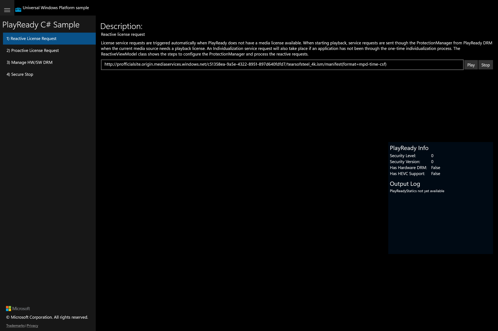

# Feature Rubric — PlayReady C# Sample

UWP capture status: **partial** — UWP app launched (Release, pid 45100, window "PlayReady C# sample").
Scenario 1 captured as a true visual golden. The UWP CoreWindow exposes only an opaque root Pane
to UI Automation, so title-driven navigation to Scenarios 2–4 failed; only Scenario 1 has a real
golden frame.

## Scenario 1 / Reactive License Request

**ID:** `reactive-license-request`
**Weight:** 2

Enter a protected media manifest URL and press Play to trigger an automatic (reactive) PlayReady
license + individualization request, then Stop to end playback.

**Expected behaviour:**
- A description block explains reactive license requests
- A movie-path TextBox pre-filled with a tears-of-steel manifest URL
- Play and Stop buttons present
- Shared PlayReady Info panel + Output Log visible

**UWP reference screenshot:**

## Scenario 2 / Proactive License Request

**ID:** `proactive-license-request`
**Weight:** 1

Acquire a PlayReady license ahead of playback for a given KeyId (Get License), then Play.

**Expected behaviour:**
- Get License button present
- KeyId TextBox pre-filled with a GUID present
- Movie-path TextBox present
- Play and Stop buttons present (disabled until a license is acquired)

**UWP reference screenshot:**
_UWP screenshot not captured (CoreWindow UIA opaque — could not navigate to this scenario)._

## Scenario 3 / Manage HW/SW DRM

**ID:** `manage-hw-sw-drm`
**Weight:** 1

Choose between hardware and software DRM before playback, then Play the protected content.

**Expected behaviour:**
- Use Hardware DRM and Use Software DRM buttons present
- Movie-path TextBox present
- Play and Stop buttons present

**UWP reference screenshot:**
_UWP screenshot not captured (CoreWindow UIA opaque — could not navigate to this scenario)._

## Scenario 4 / Secure Stop

**ID:** `secure-stop`
**Weight:** 1

Obtain a publisher certificate and renew a license to exercise the PlayReady Secure Stop flow.

**Expected behaviour:**
- Get Publisher Cert and Renew License buttons present
- Movie-path TextBox present
- Play and Stop buttons present

**UWP reference screenshot:**
_UWP screenshot not captured (CoreWindow UIA opaque — could not navigate to this scenario)._
