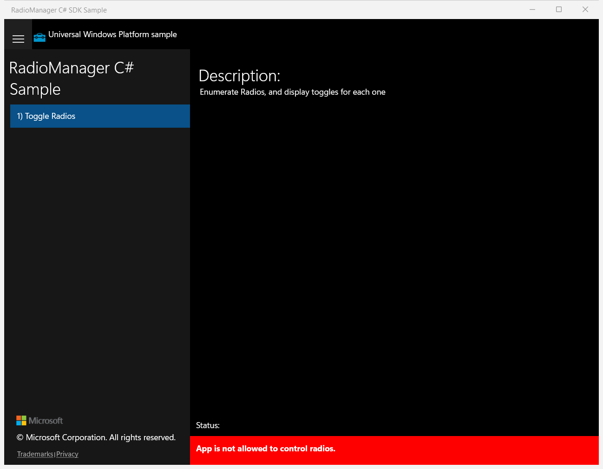

# RadioManager — UWP Feature Rubric

Ground-truth reference for scoring the migrated WinUI 3 app. Captured from the live
original UWP app (window title "RadioManager C# SDK Sample"). On this machine radio
access is denied, so the radio list is empty and the status shows an error banner —
that is the ground-truth state the WinUI app is compared against.

## Navigation / Toggle Radios navigation item

**ID:** `nav-toggle-radios`
**Weight:** 2

The sample shell lists the single scenario "1) Toggle Radios" in the navigation list;
selecting it shows the scenario page.

**Expected behaviour:**
- A navigation entry titled "Toggle Radios" (shown as "1) Toggle Radios") is visible.
- Selecting it displays the Toggle Radios scenario page.

**UWP reference screenshot:**

## Scenario page / Scenario description text

**ID:** `scenario-description`
**Weight:** 1

The scenario page shows a "Description:" header and the text "Enumerate Radios, and
display toggles for each one".

**Expected behaviour:**
- A "Description:" header is visible.
- The text "Enumerate Radios, and display toggles for each one" is visible.

**UWP reference screenshot:**

## Scenario page / Radio enumeration list with per-radio toggle

**ID:** `radio-switch-list`
**Weight:** 2

On navigation the app calls `Radio.RequestAccessAsync` then `Radio.GetRadiosAsync` and
adds one row (radio name + `ToggleSwitch`) per radio to the `RadioSwitchList`
`ItemsControl`. On this machine radio access is not granted, so the list renders empty.

**Expected behaviour:**
- A scrollable radio list area (RadioSwitchList) is present.
- One row with radio name + ToggleSwitch per available radio.
- When access is denied / no radios, the list is empty (matches UWP golden).

**UWP reference screenshot:**

## Shell / Status notification area

**ID:** `status-notification`
**Weight:** 1

The shell has a "Status:" area showing NotifyUser messages. On this machine access is
denied so it shows the error banner "App is not allowed to control radios."

**Expected behaviour:**
- A "Status:" label/area is present at the bottom of the shell.
- When access is denied, "App is not allowed to control radios." is shown.

**UWP reference screenshot:**

