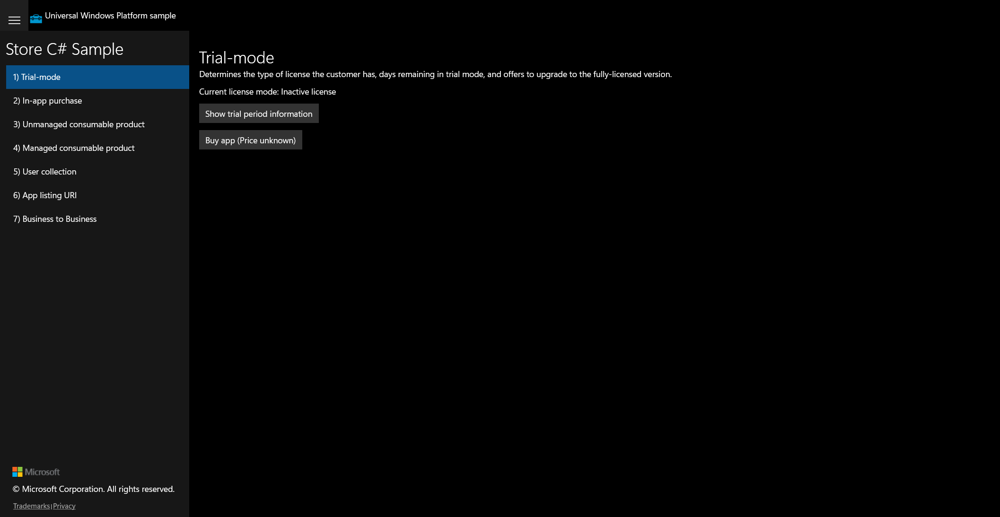

# UWP Feature Rubric — Store

_Created: 2026-07-10T08:38:14+08:00_

**UWP capture status:** partial — `uwp-app-runner` returned `ok:true` (pid 41224,
windowTitle "Store C# Sample", Release/.NET-Native, sdk 10.0.26100.0) and the app
rendered. Scenario 1 (Trial-mode) was captured as a **real rendered golden** via DWM.
Scenarios 2–7 could **not** be navigated in the original UWP app: its CoreWindow exposes
no cross-process UIA tree (`winapp ui inspect` returns a single empty Pane) **and** the
session has no interactive desktop (`SetForegroundWindow`/`SetCursorPos` fail, cursor
pinned at 0,0), so neither UIA invoke nor synthetic-mouse navigation lands. Parity was
therefore assessed structurally + behaviorally against the source-derived checklist and
the WinUI app's full UIA tree.

## Trial-mode

**ID:** `trial-mode`  
**Weight:** 2  

Shows current license mode and offers to show trial-period info and buy the app.

**Expected behaviour:**
- 'Show trial period information' button updates the license/trial text
- 'Buy app (Price unknown)' button is present

**UWP reference screenshot:**  

## In-app purchase

**ID:** `in-app-purchase`  
**Weight:** 1  

Lists associated add-ons and lets the user purchase the selected add-on.

**Expected behaviour:**
- 'Get Associated Add-Ons' populates the add-on list
- 'Purchase Selected Add-On' initiates a purchase

_UWP screenshot not captured for this scenario (UWP app not navigable in this session; see uwp_capture_status)._

## Unmanaged consumable product

**ID:** `unmanaged-consumable`  
**Weight:** 1  

Get/purchase an unmanaged consumable, query its balance, and fulfill it.

**Expected behaviour:**
- 'Get Associated Add-Ons' populates the consumable list
- Purchase / Get Balance / Fulfill buttons present and wired

_UWP screenshot not captured for this scenario (UWP app not navigable in this session; see uwp_capture_status)._

## Managed consumable product

**ID:** `managed-consumable`  
**Weight:** 1  

Get/purchase a managed consumable in a chosen QUANTITY, query balance, and fulfill.

**Expected behaviour:**
- A QuantityComboBox lets the user choose the purchase quantity
- Get / Purchase / Get Balance / Fulfill buttons present and wired

_UWP screenshot not captured for this scenario (UWP app not navigable in this session; see uwp_capture_status)._

## User collection

**ID:** `user-collection`  
**Weight:** 1  

Retrieves the user's product collection.

**Expected behaviour:**
- 'Get User Collection' retrieves and displays the collection

_UWP screenshot not captured for this scenario (UWP app not navigable in this session; see uwp_capture_status)._

## App listing URI

**ID:** `app-listing-uri`  
**Weight:** 1  

Launches the app's Store listing (rate this app).

**Expected behaviour:**
- 'Rate this app' launches/queries the app listing URI

_UWP screenshot not captured for this scenario (UWP app not navigable in this session; see uwp_capture_status)._

## Business to Business

**ID:** `b2b`  
**Weight:** 1  

Retrieves customer collections id and customer purchase id for B2B scenarios.

**Expected behaviour:**
- 'Get Customer Collections Id' returns an id
- 'Get Customer Purchase Id' returns an id

_UWP screenshot not captured for this scenario (UWP app not navigable in this session; see uwp_capture_status)._

---

RUBRIC COMPLETE: 7 features written to notes\rubric.json
