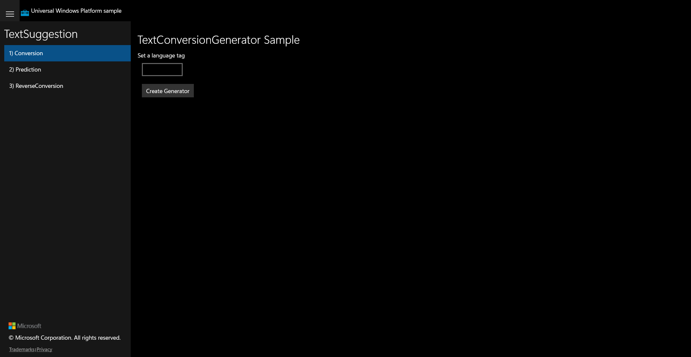

# UWP Feature Rubric — TextSuggestion

**Scenario:** TextSuggestion
**Created:** 2026-07-10T11:36:42+08:00
**UWP capture status:** _partial_ — UWP app launched in Release (pid 53156, windowTitle
`TextSuggestion`) and scenario 1 (Conversion) rendered and was captured as ground truth.
UIA could not drill into the UWP CoreWindow (ApplicationFrameHost exposed only a single
top-level Pane, 0 interactive elements), so scenarios 2/3 could not be navigated or
actuated on the UWP side. The scenario-1 visual golden is faithful; the 2/3 golden PNGs
exist but still show the initial Conversion page.

The three scenarios share the same structure: a language-tag TextBox, a **Create Generator**
button, and a **GeneratorOperationArea** (`Visibility="Collapsed"` by default) that is
revealed only when a generator is successfully instantiated — it contains a method
ComboBox, an **Input** box, an **Execute** button, and a **Result** ListView.

## Shell / Scenario navigation list

**ID:** `nav-scenario-list`
**Weight:** 2

Left-hand navigation list with the three scenarios; selecting one swaps the content frame.

**Expected behaviour:**
- All three scenario items are visible with their verbatim `1) `/`2) `/`3) ` prefixes.
- Selecting a scenario swaps the content area (distinct sample header per scenario).

**UWP reference screenshot:**

## Conversion / Create Generator

**ID:** `s1-conversion-create`
**Weight:** 2

Header 'TextConversionGenerator Sample'; langTag TextBox + Create Generator button.

**Expected behaviour:**
- Header reads 'TextConversionGenerator Sample'.
- langTag TextBox and Create Generator button present.
- Unsupported/empty tag → 'Unsupported language.', operation area stays collapsed.
- Valid installed language → 'Successfully instantiated a generator.', operation area revealed.

**UWP reference screenshot:**

## Conversion / Execute (candidates)

**ID:** `s1-conversion-execute`
**Weight:** 1

Execute (revealed after generator creation) lists conversion candidates or 'No candidates.'.

**Expected behaviour:**
- Execute/Input hidden until a generator is successfully created (by design, matches UWP).
- With a generator and non-empty Input, Execute populates resultView or shows 'No candidates.'.

**UWP reference screenshot:**

<!-- initial collapsed state — Execute not yet visible, matches UWP -->

## Prediction / Create Generator

**ID:** `s2-prediction-create`
**Weight:** 2

Header 'TextPredictionGenerator Sample'; creates a TextPredictionGenerator.

**Expected behaviour:**
- Header reads 'TextPredictionGenerator Sample'.
- Create Generator → 'Successfully instantiated a generator.' and reveals Execute/Input/Result.

**UWP reference screenshot:**
_UWP screenshot not truly navigated (ApplicationFrameHost UIA limitation); file shows initial Conversion page._

## Prediction / Execute (candidates)

**ID:** `s2-prediction-execute`
**Weight:** 1

Execute runs the prediction handler for Input and updates resultView/status.

**Expected behaviour:**
- With a generator and Input, Execute runs the prediction handler.
- resultView populated with candidates or status 'No candidates.'.

**UWP reference screenshot:**
_UWP screenshot not truly navigated (ApplicationFrameHost UIA limitation)._

## ReverseConversion / Create Generator

**ID:** `s3-reverse-create`
**Weight:** 2

Header 'TextReverseConversionGenerator Sample'; creates a TextReverseConversionGenerator.

**Expected behaviour:**
- Header reads 'TextReverseConversionGenerator Sample'.
- Unsupported/empty tag → 'Unsupported language.'; valid language → success + operation area.

**UWP reference screenshot:**
_UWP screenshot not truly navigated (ApplicationFrameHost UIA limitation)._

## ReverseConversion / Execute (candidates)

**ID:** `s3-reverse-execute`
**Weight:** 1

Execute runs the reverse-conversion handler for Input and updates resultView/status.

**Expected behaviour:**
- Execute hidden until generator created (by design).
- With a generator and Input, Execute runs the handler and updates resultView/status.

**UWP reference screenshot:**
_UWP screenshot not truly navigated (ApplicationFrameHost UIA limitation)._

## Shell / Status notification area

**ID:** `status-notification`
**Weight:** 1

Shared StatusBlock reports operation results via NotifyUser.

**Expected behaviour:**
- Status messages appear after Create Generator / Execute actions.
- Message text matches the code path taken (success / error / no candidates).

**UWP reference screenshot:**

---

RUBRIC COMPLETE: 8 features written to notes\rubric.json
