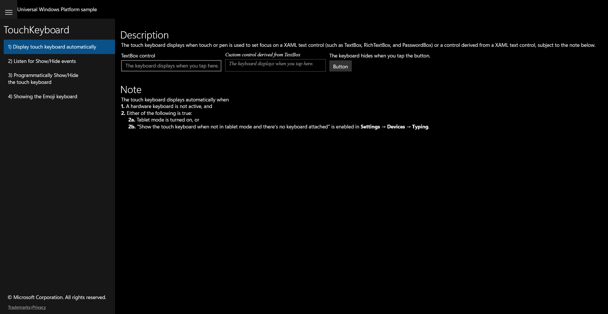

# Rubric - TouchKeyboard

UWP capture status: partial (UWP app launched ok:true; scenario 1 captured live; per-scenario CoreWindow UIA nav failed so 2-4 golden frames show scenario 1).

## Scenario 1 / Display touch keyboard automatically
**ID:** `s1-display-auto` **Weight:** 1
TextBox + custom TextBox-derived control auto-show the touch keyboard; Button hides it.
**Expected behaviour:**
- TextBox control and custom control present and editable
- Button present; hides touch keyboard (hardware-gated)

## Scenario 2 / Listen for Show/Hide events
**ID:** `s2-show-hide-events` **Weight:** 1
Subscribes to InputPane Showing/Hiding; reflects last event in a Run.
**Expected behaviour:**
- TextBox present
- LastInputPaneEventRun updates on show/hide (hardware-gated)

_UWP per-scenario frame not captured (CoreWindow nav failed); shows scenario 1._

## Scenario 3 / Programmatically Show/Hide the touch keyboard
**ID:** `s3-programmatic` **Weight:** 2
WordListBox calls TryHide() on Enter and TryShow(); ResultsTextBlock shows results.
**Expected behaviour:**
- WordListBox ('Type a few words and hit Enter.') present
- ResultsTextBlock output present

_UWP per-scenario frame not captured (CoreWindow nav failed); shows scenario 1._

## Scenario 4 / Showing the Emoji keyboard
**ID:** `s4-emoji` **Weight:** 1
TextBox focus / Button calls CoreInputView.TryShow(Emoji).
**Expected behaviour:**
- TextBox present
- Button present; invokes emoji keyboard (hardware-gated)

_UWP per-scenario frame not captured (CoreWindow nav failed); shows scenario 1._

RUBRIC COMPLETE: 4 features written to C:\ado\win-dev-skills-benchmark\agent-benchmark\results\run227\001_score-TouchKeyboard\notes\rubric.json
