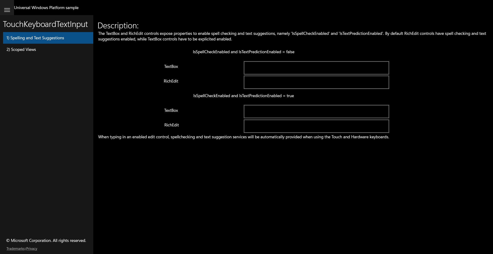

# UWP Feature Rubric — TouchKeyboardTextInput

UWP capture status: **partial** — the original UWP app launched successfully (PID 22616,
window "Touch Keyboard Text Input C# sample"). The initial frame was captured; title-driven
navigation to individual scenarios did not resolve the list items, so both per-scenario
frames reflect the default (Scenario 1) state.

## Spelling and Text Suggestions / Spell-check disabled TextBox and RichEdit

**ID:** `scenario1-spellcheck-off`
**Weight:** 2

TextBoxOff and RichEditOff have IsSpellCheckEnabled and IsTextPredictionEnabled = false.

**Expected behaviour:**
- Two editable fields under "= false" heading
- Both accept text; no spell-check underline

**UWP reference screenshot:**

## Spelling and Text Suggestions / Spell-check enabled TextBox and RichEdit

**ID:** `scenario1-spellcheck-on`
**Weight:** 2

TextBoxOn and RichEditOn have IsSpellCheckEnabled and IsTextPredictionEnabled = true.

**Expected behaviour:**
- Two editable fields under "= true" heading
- Spell-check underline appears on misspelled words

**UWP reference screenshot:**

## Spelling and Text Suggestions / Description text

**ID:** `scenario1-description`
**Weight:** 1

Explanatory text about the properties.

**Expected behaviour:**
- "Description:" header visible
- Mentions IsSpellCheckEnabled and IsTextPredictionEnabled

**UWP reference screenshot:**

## Scoped Views / Number InputScope TextBox

**ID:** `scenario2-scoped-number`
**Weight:** 1

NumberControl uses InputScope Number.

**Expected behaviour:**
- Numeric-input TextBox present and editable

**UWP reference screenshot:**

## Scoped Views / Search InputScope TextBox

**ID:** `scenario2-scoped-search`
**Weight:** 1

SearchControl uses InputScope Search.

**Expected behaviour:**
- Search-input TextBox present and editable

**UWP reference screenshot:**

## Scoped Views / Url InputScope TextBox

**ID:** `scenario2-scoped-url`
**Weight:** 1

UrlControl uses InputScope Url.

**Expected behaviour:**
- URL-input TextBox present and editable

**UWP reference screenshot:**

## Scoped Views / Email InputScope TextBox

**ID:** `scenario2-scoped-email`
**Weight:** 1

EmailControl uses InputScope EmailSmtpAddress.

**Expected behaviour:**
- Email-input TextBox present and editable

**UWP reference screenshot:**

## Scoped Views / Default InputScope TextBox

**ID:** `scenario2-scoped-default`
**Weight:** 1

DefaultControl uses InputScope Default.

**Expected behaviour:**
- Default-scope TextBox present and editable

**UWP reference screenshot:**

## Scoped Views / Telephone InputScope TextBox

**ID:** `scenario2-scoped-telephone`
**Weight:** 1

TelephoneControl uses InputScope TelephoneNumber.

**Expected behaviour:**
- Telephone-input TextBox present and editable

**UWP reference screenshot:**

## Scoped Views / Formula InputScope TextBox

**ID:** `scenario2-scoped-formula`
**Weight:** 1

FormulaControl uses InputScope Formula.

**Expected behaviour:**
- Formula-input TextBox present and editable

**UWP reference screenshot:**

## Shell / Scenario navigation list

**ID:** `navigation-shell`
**Weight:** 2

Lists both scenarios and switches content.

**Expected behaviour:**
- Both scenario titles visible in nav list
- Selecting a scenario switches the content pane

**UWP reference screenshot:**

