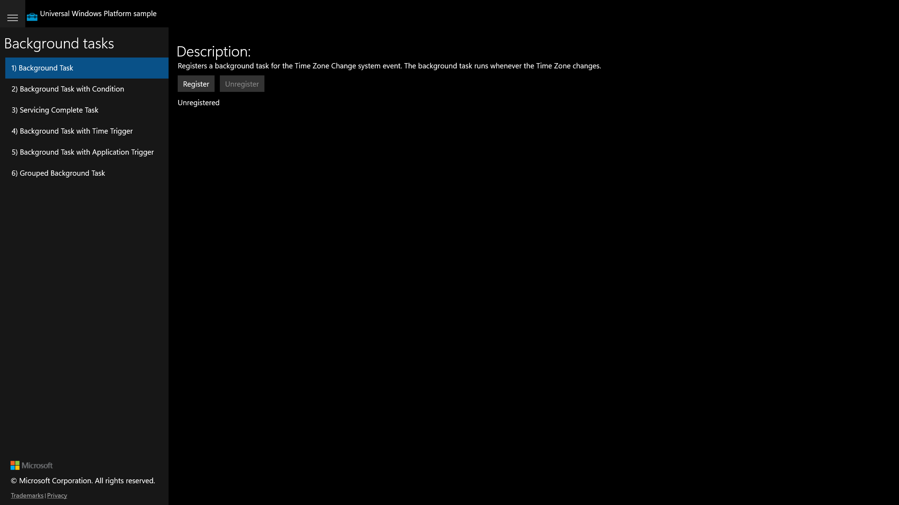

# UWP Feature Rubric — BackgroundTask

**UWP capture status:** partial — the original UWP app launched (Release, PID 24284,
window "Background Tasks C# Sample") and was screenshotted, but the legacy CoreWindow
exposes no UIA subtree (only a top-level Pane), so per-scenario navigation could not be
automated. Every saved frame shows the scenario-list landing view with Scenario 1
selected. All six scenarios are visible in the list; Scenario 1's controls are captured
as functional ground truth.

## Background Task / Background Task (system event)
**ID:** `scenario-1-background-task`
**Weight:** 2

Registers/unregisters a background task for the Time Zone Change system event.

**Expected behaviour:**
- Description, Register (enabled), Unregister (disabled), status 'Unregistered'.
- Register → status 'Registered', Unregister enabled.
- Unregister → status 'Unregistered'.

**UWP reference screenshot:**

## Background Task with Condition
**ID:** `scenario-2-background-task-with-condition`
**Weight:** 1

Conditional task (runs on Time Zone Change while internet-available holds).

**Expected behaviour:**
- Register → 'Registered'; Unregister → 'Unregistered'.

_UWP screenshot shows the landing/list view (per-scenario pane could not be isolated)._

## Servicing Complete Task
**ID:** `scenario-3-servicing-complete-task`
**Weight:** 1

Task triggered by the ServicingComplete maintenance trigger.

**Expected behaviour:**
- Register → 'Registered'; Unregister → 'Unregistered'.

_UWP screenshot shows the landing/list view._

## Background Task with Time Trigger
**ID:** `scenario-4-time-triggered-task`
**Weight:** 1

Requests background access then registers a 15-minute TimeTrigger task.

**Expected behaviour:**
- Register requests access + registers → 'Registered'; Unregister → 'Unregistered'.

_UWP screenshot shows the landing/list view._

## Background Task with Application Trigger
**ID:** `scenario-5-application-trigger-task`
**Weight:** 2

ApplicationTrigger task the app can signal on demand.

**Expected behaviour:**
- Register → 'Registered'.
- Signal Background Task → task fires, result/progress displayed.
- Unregister → 'Unregistered'.

_UWP screenshot shows the landing/list view._

## Grouped Background Task
**ID:** `scenario-6-grouped-background-task`
**Weight:** 1

Task inside a BackgroundTaskRegistrationGroup; separate unregister of grouped vs
ungrouped tasks.

**Expected behaviour:**
- Register → 'Registered'.
- Unregister grouped / unregister ungrouped actions.

_UWP screenshot shows the landing/list view._

RUBRIC COMPLETE: 6 features written to notes\rubric.json
