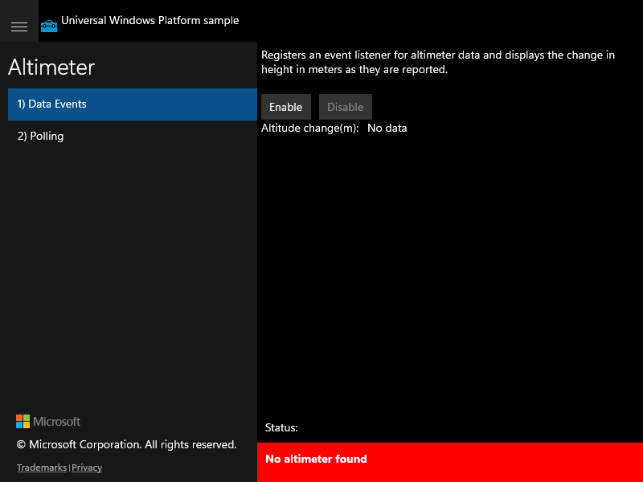

# Altimeter — UWP feature rubric

Authoritative reference for scoring the migrated WinUI 3 app. Derived from the live UWP
app (Scenario 1 captured) and the UWP source (Scenario 2).

**UWP capture status:** partial — Scenario 1 (Data Events) captured live from the UWP
CoreWindow; Scenario 2 (Polling) could not be driven live (UWP CoreWindow is UIA-opaque
under ApplicationFrameHost and synthetic input/foreground activation is blocked in this
non-interactive session). Scenario 2 ground truth taken from source.

**Hardware note:** this machine has **no altimeter sensor**, so both the UWP golden and
the WinUI app show `No altimeter found` and produce no readings — sensor readouts are
hardware-gated in *both* apps, so a non-responsive Get Data/Enable is parity, not a defect.

## Shell / Scenario navigation list

**ID:** `scenario-navigation`
**Weight:** 2

Left-hand list exposes the two scenarios and selecting one shows that scenario's page.

**Expected behaviour:**
- List shows exactly two items: '1) Data Events' and '2) Polling'
- Selecting an item highlights it and swaps the right-hand content pane
- Item titles are verbatim from the UWP source

**UWP reference screenshot:**

## Data Events / Enable/Disable buttons

**ID:** `data-events-controls`
**Weight:** 2

Registers/unregisters an altimeter ReadingChanged listener via Enable/Disable.

**Expected behaviour:**
- Both 'Enable' and 'Disable' buttons present with those exact labels
- Handlers wired to register/unregister ReadingChanged and toggle enabled state
- With a real altimeter, Enable begins updates and disables itself while enabling Disable

**UWP reference screenshot:**

## Data Events / Altitude output

**ID:** `data-events-output`
**Weight:** 1

Displays 'Altitude change(m):' with a value updated on each ReadingChanged event.

**Expected behaviour:**
- Label 'Altitude change(m):' shown with an output value ('No data' when idle)
- Value updates to a formatted altitude change when the sensor reports

**UWP reference screenshot:**

## Polling / Get Data button

**ID:** `polling-control`
**Weight:** 2

Reads the current altimeter value on demand via a 'Get Data' button.

**Expected behaviour:**
- A 'Get Data' button present with that exact label
- Handler ScenarioGetData wired to read the current altimeter reading
- With a real altimeter, clicking updates the altitude change output

**UWP reference screenshot:**
_UWP screenshot not captured (Polling page not reachable via automation on the live UWP CoreWindow; ground truth from source Scenario2_Polling.xaml.cs)._

## Polling / Altitude output

**ID:** `polling-output`
**Weight:** 1

Displays 'Altitude change(m):' with a value updated when Get Data is clicked.

**Expected behaviour:**
- Label 'Altitude change(m):' shown with an output value ('No data' initially)
- Value updates to the current formatted altitude change on Get Data when a sensor is present

**UWP reference screenshot:**
_UWP screenshot not captured (see above)._

## Shell / No-altimeter status handling

**ID:** `no-sensor-status`
**Weight:** 1

On hardware without an altimeter, both scenarios report 'No altimeter found'.

**Expected behaviour:**
- A red status banner shows 'No altimeter found' when no altimeter is present
- Scenarios degrade gracefully rather than crashing

**UWP reference screenshot:**

RUBRIC COMPLETE: 6 features
