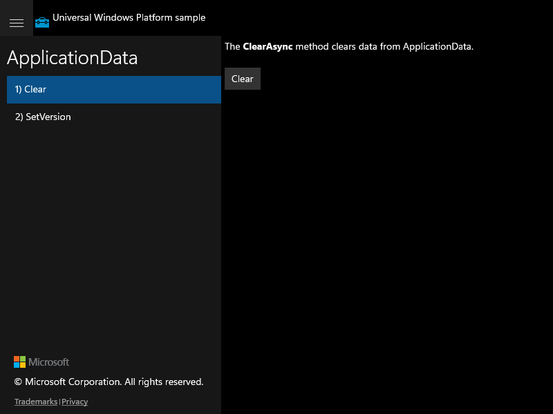

# UWP Rubric — ApplicationData

**UWP capture status:** partial — the original UWP app launched (PID 17820, window
"ApplicationData C# Sample") and was screenshotted, but it could **not** be navigated or
actuated: the session sits at the Windows lock screen (foreground window =
"Windows Default Lock Screen"), so synthetic mouse input never reaches the app, and the
legacy UWP CoreWindow exposes **no inner UIA tree** (0 interactive elements), so
`winapp ui invoke` finds nothing. Only the default-rendered Clear scenario frame was
captured. Behavioral expectations below are derived from the UWP source.

## Clear / Clear scenario page renders

**ID:** `clear-scenario-render`
**Weight:** 1

Scenario 1 shows "The ClearAsync method clears data from ApplicationData." and a Clear button.

**Expected behaviour:**
- Scenario list shows "1) Clear" and "2) SetVersion"
- Content pane shows the ClearAsync description text and a Clear button

**UWP reference screenshot:**

## Clear / Clear button clears ApplicationData

**ID:** `clear-button`
**Weight:** 2

Clicking Clear calls `ApplicationData.Current.ClearAsync()` and sets OutputTextBlock.

**Expected behaviour:**
- Clicking Clear shows "ApplicationData has been cleared.  Visit the other scenarios to see that their data has been cleared."

**UWP reference screenshot:**

## SetVersion / SetVersion scenario page renders

**ID:** `setversion-scenario-render`
**Weight:** 1

Scenario 2 shows the versioning description, two buttons, and an initial "Version: N".

**Expected behaviour:**
- Two buttons "Set version to 0" and "Set version to 1" are visible
- Initial output shows "Version: <current version>" on navigation

**UWP reference screenshot:**
_UWP screenshot not captured (could not navigate the locked-session UWP app; behaviour from source)._

## SetVersion / Set version to 0

**ID:** `setversion-0`
**Weight:** 1

Clicking "Set version to 0" calls `SetVersionAsync(0, handler)` and displays "Version: 0".

**Expected behaviour:**
- After clicking, output shows "Version: 0"

**UWP reference screenshot:**
_UWP screenshot not captured (could not navigate the locked-session UWP app; behaviour from source)._

## SetVersion / Set version to 1

**ID:** `setversion-1`
**Weight:** 2

Clicking "Set version to 1" calls `SetVersionAsync(1, handler)` and displays "Version: 1".

**Expected behaviour:**
- After clicking, output shows "Version: 1"

**UWP reference screenshot:**
_UWP screenshot not captured (could not navigate the locked-session UWP app; behaviour from source)._
