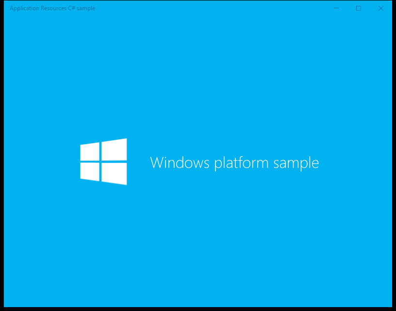
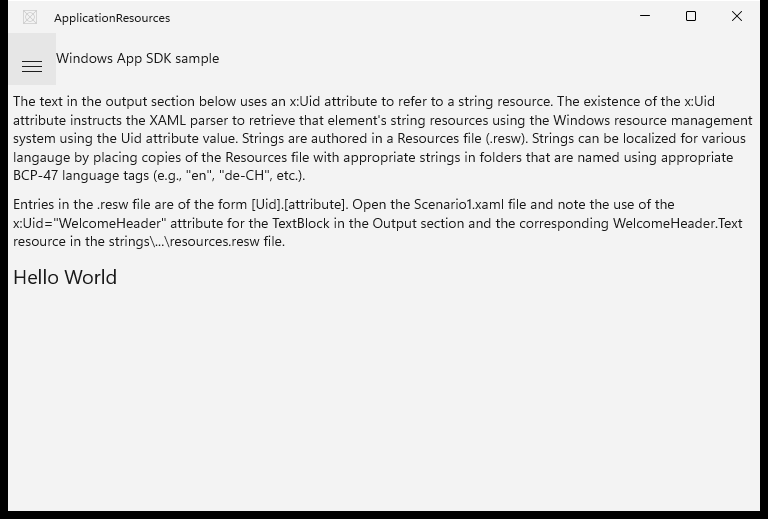
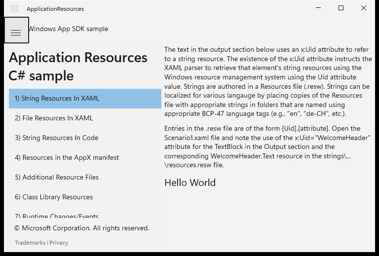
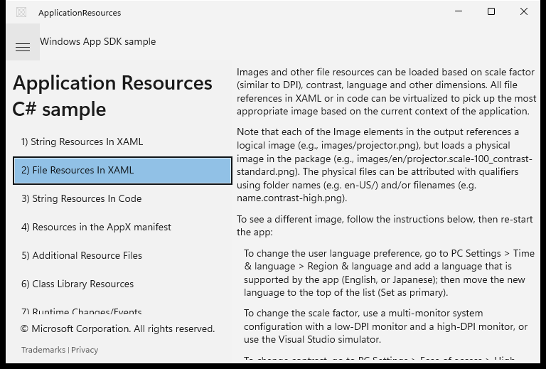

# Migration Score: ApplicationResources

| Metric | Value |
|--------|-------|
| UWP launchable | ✅ yes (PID 2996, "Application Resources C# sample") |
| WinUI 3 launched | ✅ yes |
| Features evaluated | 1 |
| Pass | 1 |
| Partial | 0 |
| Fail | 0 |
| Behavioral regressions | 0 |
| **Score** | **100** |

Parity gate (`Compare-Parity.ps1`) verdict: **FAIL — structural cov 1/4**. Reconciled as a
capture artifact of the collapsed NavigationView pane (see `discrepancies.md`); manual
expansion confirms full structural + behavioral parity.

---

## Shell / ApplicationResources — scenario navigation + default resource scenario

**Verdict:** ✅ Pass

Faithful, fully functional migration verified by direct observation:
- App launches and presents a non-blank window.
- Full 13-scenario navigation list present (verified after expanding the nav pane);
  selecting "2) File Resources In XAML" navigates to scenario 2's distinct content — the
  navigation is behaviorally **live**.
- Core feature works: the `x:Uid`-bound resource string **"Hello World"** resolves from
  `resources.resw` (the whole point of the sample).
- Sample title "Application Resources C# sample" and "© Microsoft Corporation" copyright
  present; **Trademarks | Privacy** footer links present.
- Trademarks/Privacy are dead in-app in **both** UWP and WinUI (external URLs) → no
  behavioral regression.
- Minor cosmetic: WinUI header rebranded "Windows platform sample" → "Windows App SDK
  sample" and skips the UWP splash logo. Expected modernization.

| UWP reference | WinUI 3 result |
|---------------|----------------|
|  |  |
| — | Nav expanded:  |
| — | Scenario 2 live:  |

**Expected behaviour checklist:**
- [x] App launches, non-blank window
- [x] Scenario navigation list exposes scenarios; selection navigates
- [x] Default scenario shows x:Uid resource string "Hello World"
- [x] Sample title + copyright shown
- [x] Trademarks/Privacy footer links present (dead in-app in both — parity)

SCORE COMPLETE: 1 feature, weighted score 100.0% → notes/migration-score.json
