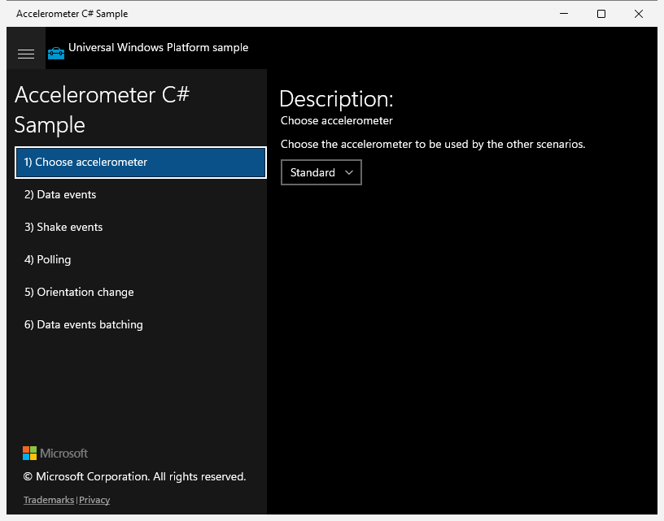
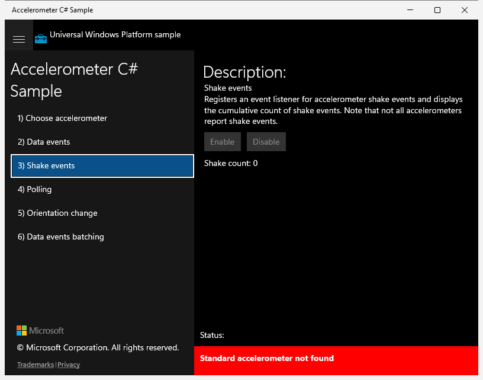
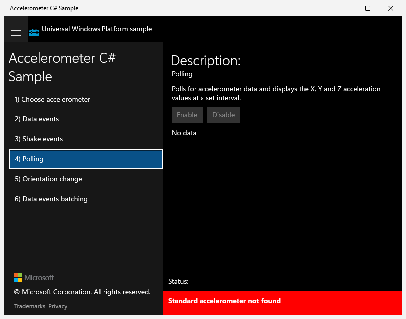
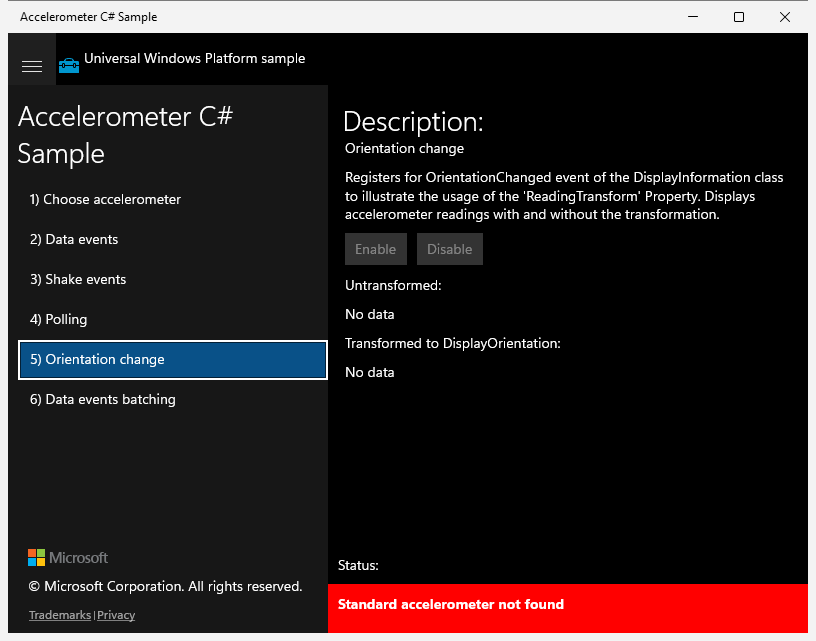
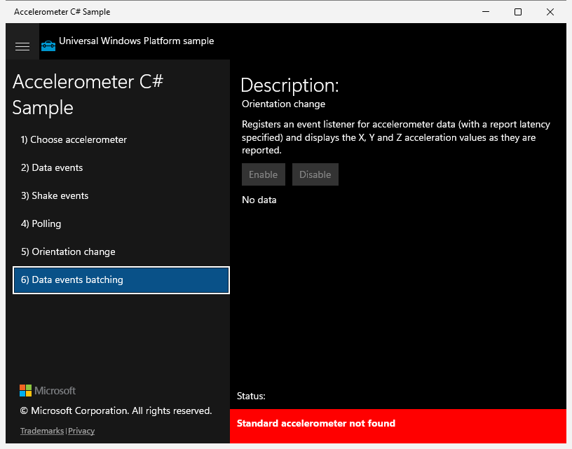

# UWP Rubric — Accelerometer

UWP capture status: **ok** (original UWP app launched via `uwp-app-runner`, PID 8848, window "Accelerometer C# Sample"). Note: this machine has **no accelerometer hardware**, so every scenario's Status reads "Standard accelerometer not found" and the Enable/Disable buttons are disabled — this is the ground-truth behaviour to match.

## Scenario 1 / Choose accelerometer

**ID:** `choose-accelerometer`
**Weight:** 2

Lets the user pick which accelerometer subsequent scenarios use, via a ComboBox.

**Expected behaviour:**
- Description "Choose the accelerometer to be used by the other scenarios." shown
- A ComboBox (default 'Standard') present and enabled

**UWP reference screenshot:**

## Scenario 2 / Data events

**ID:** `data-events`
**Weight:** 1

Registers a ReadingChanged listener and shows X/Y/Z values; gated by Enable/Disable.

**Expected behaviour:**
- Enable and Disable buttons present
- Output region for reading values present
- Status "Standard accelerometer not found" with no hardware

**UWP reference screenshot:**

## Scenario 3 / Shake events

**ID:** `shake-events`
**Weight:** 1

Registers a Shaken listener and displays a cumulative shake count.

**Expected behaviour:**
- Enable and Disable buttons present
- "Shake count: 0" output shown
- Status "Standard accelerometer not found" with no hardware

**UWP reference screenshot:**

## Scenario 4 / Polling

**ID:** `polling`
**Weight:** 1

Polls the accelerometer at an interval and displays X/Y/Z values.

**Expected behaviour:**
- Enable and Disable buttons present
- "No data" placeholder shown
- Status "Standard accelerometer not found" with no hardware

**UWP reference screenshot:**

## Scenario 5 / Orientation change

**ID:** `orientation-change`
**Weight:** 1

Uses ReadingTransform to show readings with and without display-orientation transformation.

**Expected behaviour:**
- Enable and Disable buttons present
- "Untransformed:" and "Transformed to DisplayOrientation:" sections each show "No data"
- Status "Standard accelerometer not found" with no hardware

**UWP reference screenshot:**

## Scenario 6 / Data events batching

**ID:** `data-events-batching`
**Weight:** 1

Registers a ReadingChanged listener with report latency (batching) and displays X/Y/Z values.

**Expected behaviour:**
- Enable and Disable buttons present
- Output region for reading values present
- Status "Standard accelerometer not found" with no hardware

**UWP reference screenshot:**

