# Migration Score: AudioCategory

| Metric | Value |
|--------|-------|
| Features evaluated | 10 |
| Pass | 10 |
| Partial | 0 |
| Fail | 0 |
| Behavioral regressions | 0 |
| **Weighted score** | **100.0%** |

**UWP capture status:** degraded — the original UWP app launched (`uwp-app-runner` ok:true) but hung on its splash screen and never presented its main page (UI thread not responding, empty UIA tree). No live UWP golden was obtainable; scoring relied on the source-derived checklist, structural control coverage (Compare-Parity PASS 10/10), and direct behavioral+visual inspection of the WinUI app.

---

## Audio Category Sample / Movie

**Verdict:** ✅ Pass

Scenario present with correct title, Description text, functional 'Select Audio File' button (opens audio-filtered file picker), and Play/Pause/Stop controls. Control is live (after-click frame shows the Open dialog). Structural coverage 1/1.

| UWP reference (splash only — app hung) | WinUI 3 result | WinUI 3 after click |
|---|---|---|
|  | 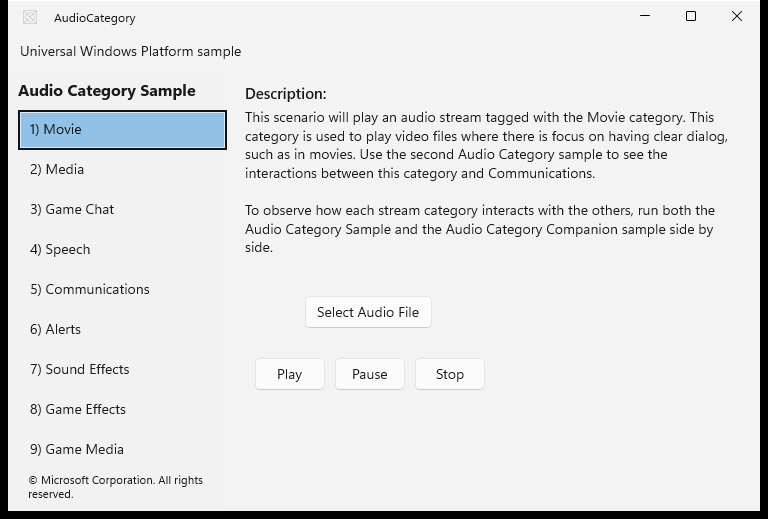 |  |

**Expected behaviour checklist:**
- [x] Scenario listed and selectable
- [x] Description text shown
- [x] 'Select Audio File' opens an audio-filtered file picker
- [x] Play / Pause / Stop controls present

## Audio Category Sample / Media

**Verdict:** ✅ Pass

Scenario present with correct title, Description text, functional 'Select Audio File' button (opens audio-filtered file picker), and Play/Pause/Stop controls. Control is live (after-click frame shows the Open dialog). Structural coverage 1/1.

| UWP reference (splash only — app hung) | WinUI 3 result | WinUI 3 after click |
|---|---|---|
|  | 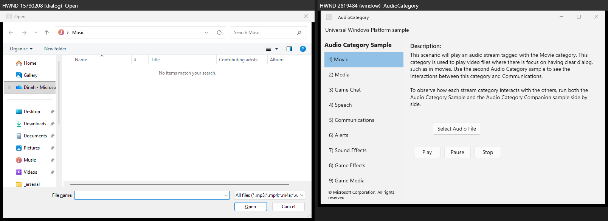 | 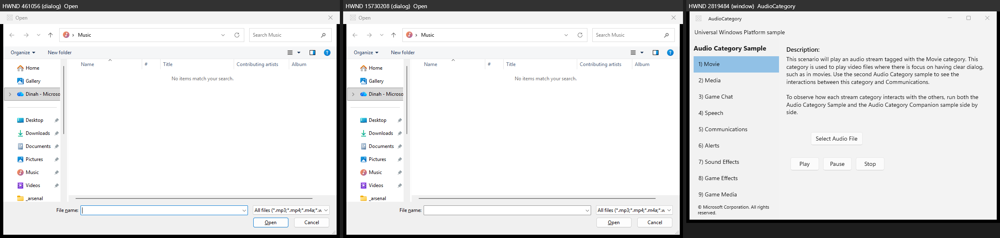 |

**Expected behaviour checklist:**
- [x] Scenario listed and selectable
- [x] Description text shown
- [x] 'Select Audio File' opens an audio-filtered file picker
- [x] Play / Pause / Stop controls present

## Audio Category Sample / Game Chat

**Verdict:** ✅ Pass

Scenario present with correct title, Description text, functional 'Select Audio File' button (opens audio-filtered file picker), and Play/Pause/Stop controls. Control is live (after-click frame shows the Open dialog). Structural coverage 1/1.

| UWP reference (splash only — app hung) | WinUI 3 result | WinUI 3 after click |
|---|---|---|
|  | 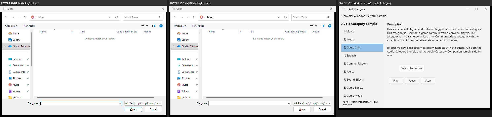 | 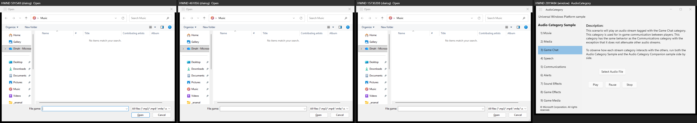 |

**Expected behaviour checklist:**
- [x] Scenario listed and selectable
- [x] Description text shown
- [x] 'Select Audio File' opens an audio-filtered file picker
- [x] Play / Pause / Stop controls present

## Audio Category Sample / Speech

**Verdict:** ✅ Pass

Scenario present with correct title, Description text, functional 'Select Audio File' button (opens audio-filtered file picker), and Play/Pause/Stop controls. Control is live (after-click frame shows the Open dialog). Structural coverage 1/1.

| UWP reference (splash only — app hung) | WinUI 3 result | WinUI 3 after click |
|---|---|---|
|  | 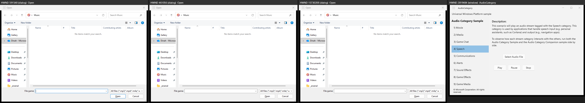 | 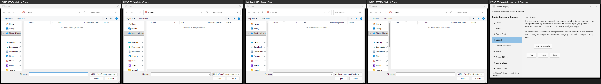 |

**Expected behaviour checklist:**
- [x] Scenario listed and selectable
- [x] Description text shown
- [x] 'Select Audio File' opens an audio-filtered file picker
- [x] Play / Pause / Stop controls present

## Audio Category Sample / Communications

**Verdict:** ✅ Pass

Scenario present with correct title, Description text, functional 'Select Audio File' button (opens audio-filtered file picker), and Play/Pause/Stop controls. Control is live (after-click frame shows the Open dialog). Structural coverage 1/1.

| UWP reference (splash only — app hung) | WinUI 3 result | WinUI 3 after click |
|---|---|---|
|  | 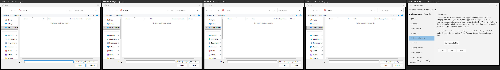 | 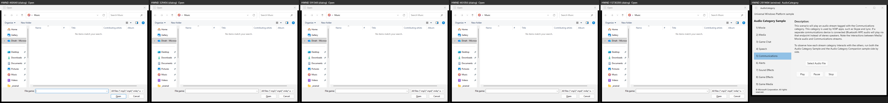 |

**Expected behaviour checklist:**
- [x] Scenario listed and selectable
- [x] Description text shown
- [x] 'Select Audio File' opens an audio-filtered file picker
- [x] Play / Pause / Stop controls present

## Audio Category Sample / Alerts

**Verdict:** ✅ Pass

Scenario present with correct title, Description text, functional 'Select Audio File' button (opens audio-filtered file picker), and Play/Pause/Stop controls. Control is live (after-click frame shows the Open dialog). Structural coverage 1/1.

| UWP reference (splash only — app hung) | WinUI 3 result | WinUI 3 after click |
|---|---|---|
|  | 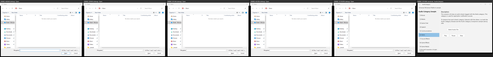 | 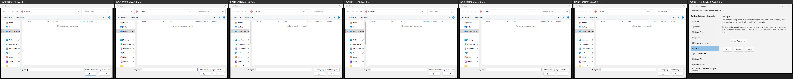 |

**Expected behaviour checklist:**
- [x] Scenario listed and selectable
- [x] Description text shown
- [x] 'Select Audio File' opens an audio-filtered file picker
- [x] Play / Pause / Stop controls present

## Audio Category Sample / Sound Effects

**Verdict:** ✅ Pass

Scenario present with correct title, Description text, functional 'Select Audio File' button (opens audio-filtered file picker), and Play/Pause/Stop controls. Control is live (after-click frame shows the Open dialog). Structural coverage 1/1.

| UWP reference (splash only — app hung) | WinUI 3 result | WinUI 3 after click |
|---|---|---|
|  | 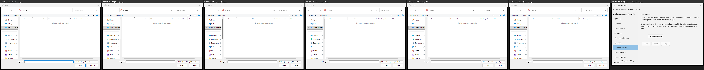 | 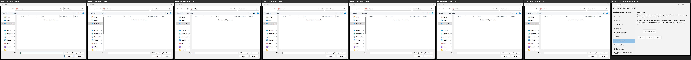 |

**Expected behaviour checklist:**
- [x] Scenario listed and selectable
- [x] Description text shown
- [x] 'Select Audio File' opens an audio-filtered file picker
- [x] Play / Pause / Stop controls present

## Audio Category Sample / Game Effects

**Verdict:** ✅ Pass

Scenario present with correct title, Description text, functional 'Select Audio File' button (opens audio-filtered file picker), and Play/Pause/Stop controls. Control is live (after-click frame shows the Open dialog). Structural coverage 1/1.

| UWP reference (splash only — app hung) | WinUI 3 result | WinUI 3 after click |
|---|---|---|
| 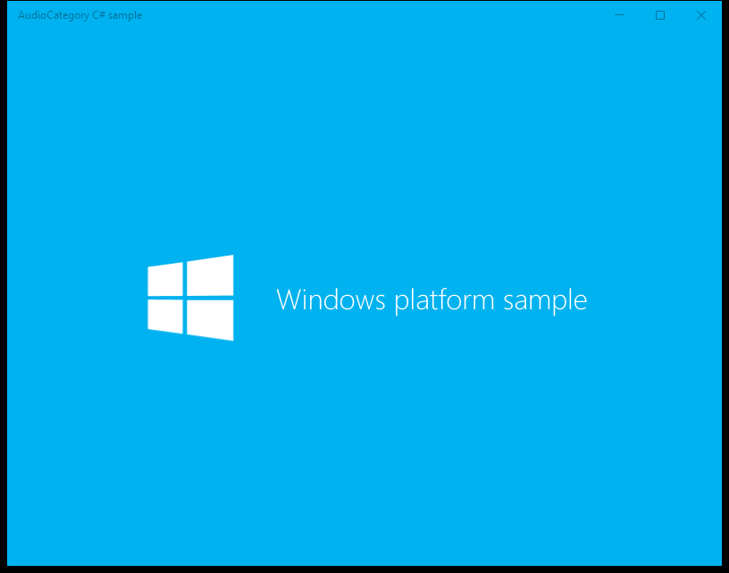 | 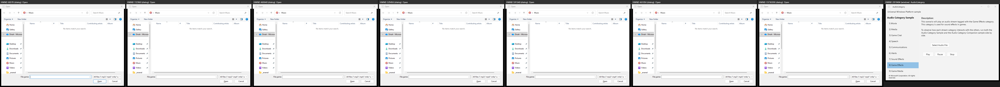 | 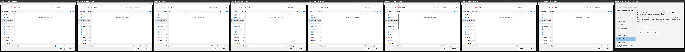 |

**Expected behaviour checklist:**
- [x] Scenario listed and selectable
- [x] Description text shown
- [x] 'Select Audio File' opens an audio-filtered file picker
- [x] Play / Pause / Stop controls present

## Audio Category Sample / Game Media

**Verdict:** ✅ Pass

Scenario present with correct title, Description text, functional 'Select Audio File' button (opens audio-filtered file picker), and Play/Pause/Stop controls. Control is live (after-click frame shows the Open dialog). Structural coverage 1/1.

| UWP reference (splash only — app hung) | WinUI 3 result | WinUI 3 after click |
|---|---|---|
|  |  | 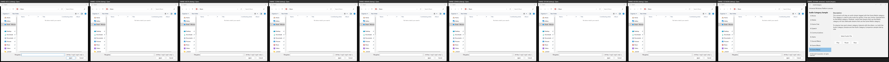 |

**Expected behaviour checklist:**
- [x] Scenario listed and selectable
- [x] Description text shown
- [x] 'Select Audio File' opens an audio-filtered file picker
- [x] Play / Pause / Stop controls present

## Audio Category Sample / Other

**Verdict:** ✅ Pass

Scenario present with correct title, Description text, functional 'Select Audio File' button (opens audio-filtered file picker), and Play/Pause/Stop controls. Control is live (after-click frame shows the Open dialog). Structural coverage 1/1.

| UWP reference (splash only — app hung) | WinUI 3 result | WinUI 3 after click |
|---|---|---|
|  | 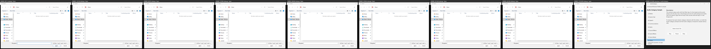 | 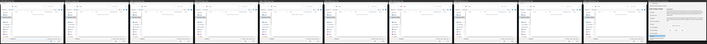 |

**Expected behaviour checklist:**
- [x] Scenario listed and selectable
- [x] Description text shown
- [x] 'Select Audio File' opens an audio-filtered file picker
- [x] Play / Pause / Stop controls present

