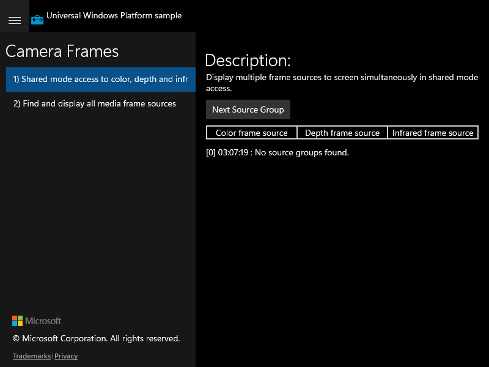
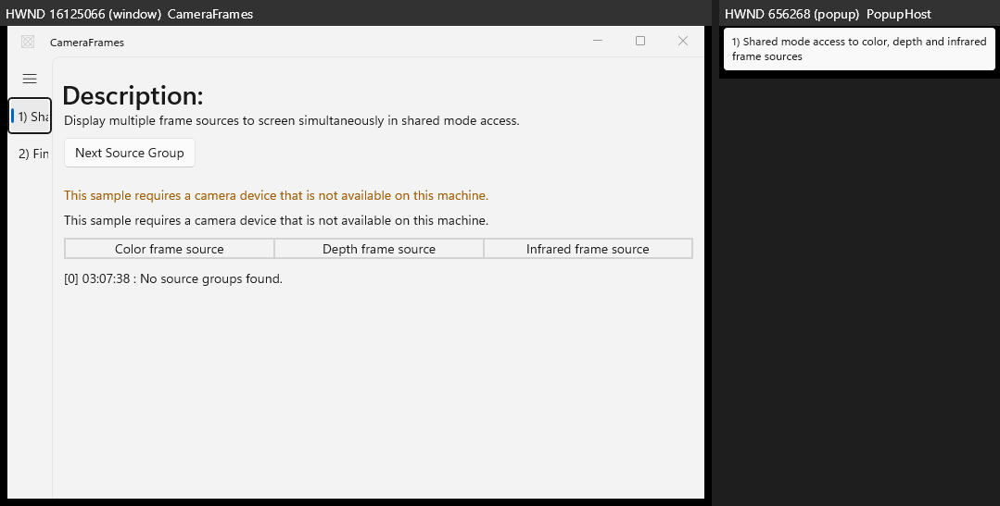
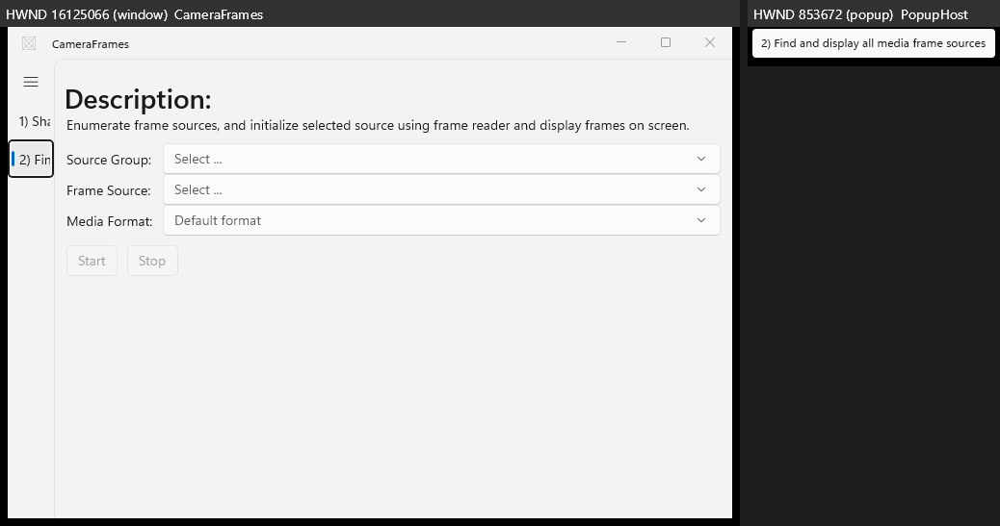

# Migration Score: CameraFrames

| Metric | Value |
|--------|-------|
| Features evaluated | 2 |
| Pass | 1 |
| Partial | 1 |
| Fail | 0 |
| **Weighted score** | **75.0%** |
| UWP launchable | true |
| UWP capture status | partial (see below) |
| Behavioural regressions | 0 |

**UWP capture status:** UWP launched via `uwp-app-runner` (`ok:true`, pid 20260); scenario
1 captured live from the CoreWindow (hwnd 918596). The UWP UI thread then hung
(`Responding=false`) on no-camera hardware, frozen on "No source groups found". The legacy
CoreWindow exposes an opaque UIA tree (single Pane, no children), so scenario 2 could not
be navigated via UIA invoke nor simulated input. Scenario 2's reference is source-derived.

---

## Scenario 1 / Shared mode access to color, depth and infrared frame sources

**Verdict:** ✅ Pass

Full structural coverage (1/1). Description text, "Next Source Group" button,
Color/Depth/Infrared frame-source labels and the "No source groups found." status all match
the live UWP golden. "Next Source Group" actuates and the UIA text state changes
(`responded=true`) — a live control. Frames non-blank throughout. Minor cosmetic diffs:
the camera-unavailable fallback message renders twice, and the theme is light vs the UWP's
dark capture.

| UWP reference | WinUI 3 result |
|---------------|----------------|
|  |  |

**Expected behaviour checklist:**
- [x] Reachable from nav list with verbatim title
- [x] Description matches UWP
- [x] "Next Source Group" button present and invokable
- [x] Color/Depth/Infrared frame source labels present
- [x] Status line reports "No source groups found."

---

## Scenario 2 / Find and display all media frame sources

**Verdict:** ⚠️ Partial

All five controls are present with AutomationIds (`GroupComboBox`, `SourceComboBox`,
`FormatComboBox`, `StartButton`, `StopButton`) plus the matching description, an output text
block and a preview image. The automated gate's 2/5 coverage is a **false negative** — the
UWP source ComboBoxes have empty names, so the matcher has no key; the combos are actually
present (verified in `parity/winui3/ui/02.json` and the screenshot). Start/Stop are correctly
**disabled** (no camera → no selectable source group), so no control could be actuated to
confirm the select-group → Start → preview data flow. The UWP golden could not demonstrate
that flow either (UI thread hung, no camera), so behavioural parity is **unconfirmed** rather
than proven broken — scored partial conservatively. No dead control.

| UWP reference | WinUI 3 result |
|---------------|----------------|
| _not captured (UWP hung before scenario 2)_ |  |

**Expected behaviour checklist:**
- [x] Reachable from nav list with verbatim title
- [x] Description matches UWP
- [x] Three ComboBoxes present (Source Group / Frame Source / Media Format)
- [x] Start and Stop buttons present, disabled until a source group is selected
- [ ] Behavioural data flow (select → Start → live preview) verified end-to-end (blocked: no camera)

---

**Note on comparability:** Both the UWP golden and the migrated WinUI 3 app were exercised
on the same no-camera machine, where both report "No source groups found." The migration
faithfully reproduces both scenarios' structure, text and control set; the only gap is a
camera-dependent runtime path that cannot be exercised on this hardware for either app.
