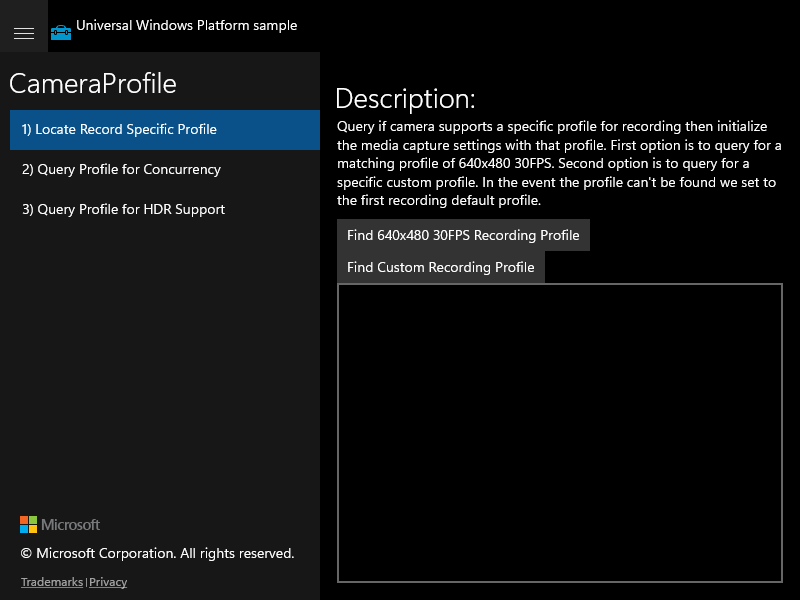

# CameraProfile — UWP Feature Rubric

**UWP capture status:** partial — the original UWP app launched (`ok:true`, pid 23188) and
its initial frame was captured, but `winapp` UIA could not drive the
`ApplicationFrameHost`-hosted CoreWindow (only a top-level Pane is exposed), so per-scenario
navigation and control actuation could not be performed against the UWP golden. Scenario 1's
initial frame is a genuine golden; scenarios 2–3 golden frames are duplicates of the
scenario-1 view. Behavior is derived from the UWP source and confirmed visually against the
migrated app.

## Scenario 1 / Locate Record Specific Profile

**ID:** `locate-record-specific-profile`
**Weight:** 2

Query if the camera supports a specific recording profile (640x480 30FPS) and a custom
recording profile; report results into the output box and status bar.

**Expected behaviour:**
- Left navigation lists all three scenarios with verbatim titles
- 'Find 640x480 30FPS Recording Profile' button appends query output to the output box
- 'Find Custom Recording Profile' button appends query output to the output box
- On a device with no camera, an ERROR status is shown

**UWP reference screenshot:**

## Scenario 2 / Query Profile for Concurrency

**ID:** `query-profile-for-concurrency`
**Weight:** 1

Query front and rear cameras for a matching concurrent profile and report the outcome.

**Expected behaviour:**
- 'Query for Concurrent Profile' button appends front/back panel enumeration output
- On a device with no camera, ERROR 'A capture device doesn't support Video Profile' is shown

**UWP reference screenshot:**
_UWP screenshot not captured (nav could not be driven via UIA); WinUI candidate verified visually._

## Scenario 3 / Query Profile for HDR Support

**ID:** `query-profile-for-hdr-support`
**Weight:** 1

Acquire record media descriptions from the available video profile and query for HDR support.

**Expected behaviour:**
- 'Query Profile for HDR Support' button appends HDR query output to the output box
- On a device with no camera, ERROR 'No Video Device Id found, verify your device supports profiles' is shown

**UWP reference screenshot:**
_UWP screenshot not captured (nav could not be driven via UIA); WinUI candidate verified visually._
