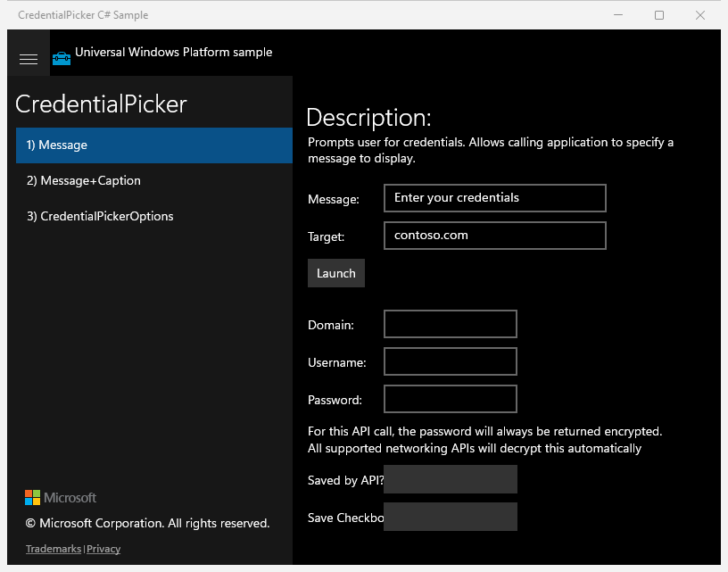
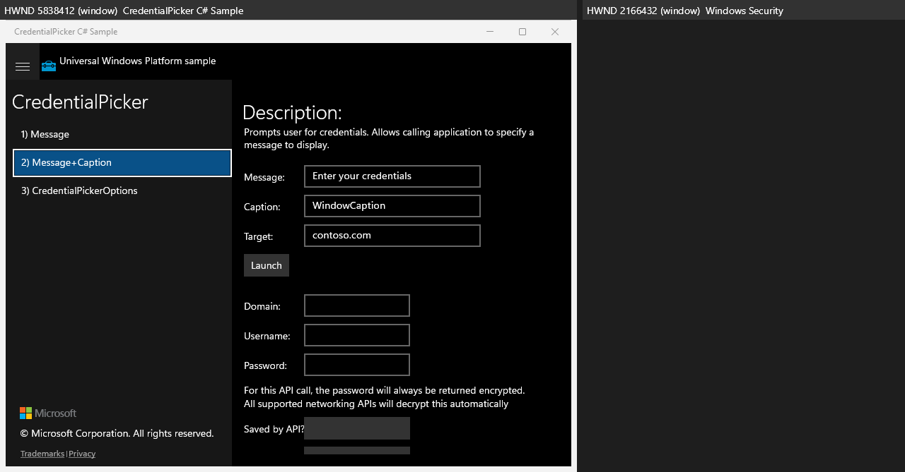
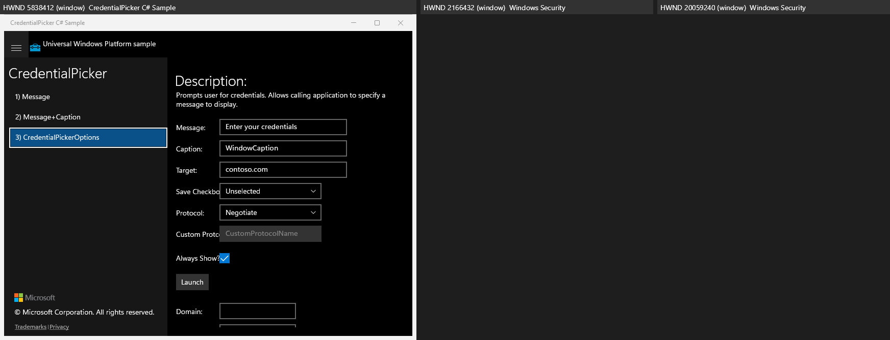

# CredentialPicker — UWP Rubric

## Scenario 1 / Message - prompt with custom message

**ID:** `scenario1-message`
**Weight:** 2

Scenario 1 lets the user enter a Message and Target, then click Launch to invoke `CredentialPicker.PickAsync` with a message. Result fields are displayed.

**Expected behaviour:**
- Message and Target TextBoxes present with default text
- Launch button present and invokes the credential picker (visible response)
- Result fields (Domain, Username, Password, CredentialSaved, CheckboxState, Status) present

**UWP reference screenshot:**

## Scenario 2 / Message+Caption

**ID:** `scenario2-message-caption`
**Weight:** 1

Adds a Caption TextBox. Launch invokes PickAsync with message and caption.

**Expected behaviour:**
- Message, Caption, Target TextBoxes present
- Launch button present and invokes the picker
- Result fields present

**UWP reference screenshot:**

## Scenario 3 / CredentialPickerOptions

**ID:** `scenario3-options`
**Weight:** 2

Full options: SaveCheckboxSelection + ProtocolSelection ComboBoxes, CustomProtocol TextBox, AlwaysShowDialog CheckBox, plus Message/Caption/Target and Launch.

**Expected behaviour:**
- Both ComboBoxes present
- CustomProtocol TextBox and AlwaysShowDialog CheckBox present
- Launch button present and invokes the picker with options
- Result fields present

**UWP reference screenshot:**

