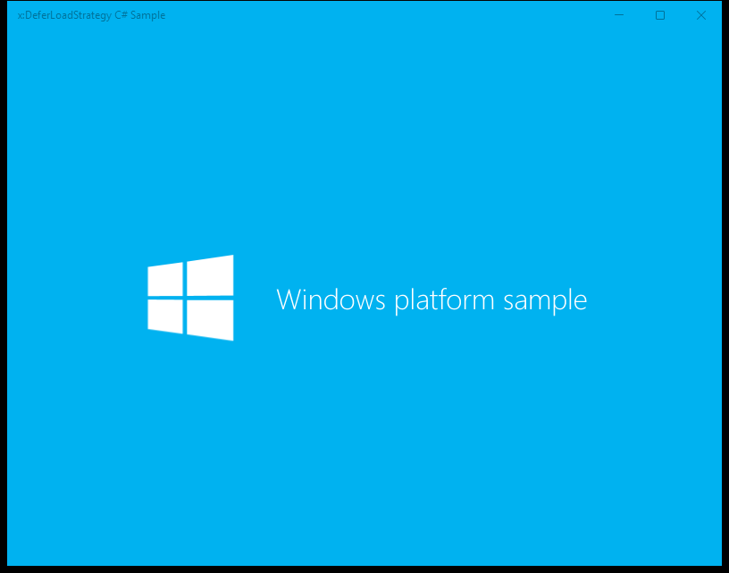

# XamlDeferLoadStrategy UWP rubric

**UWP capture status:** Partial. The runner launched the UWP process, but the app remained on its splash screen and its CoreWindow exposed no scenario controls. The links below reference the real frames saved by the capture pipeline.

## Basic Deferral / Deferred element realization

**ID:** `basic-deferral`  
**Weight:** 2

The page initially defers a four-color grid and realizes it when the Realize Elements button is clicked.

**Expected behaviour:**
- The explanatory text and Realize Elements button are visible.
- Clicking Realize Elements makes the orange, green, blue, and yellow grid visible.

**UWP reference screenshot:**  

## Adaptive Deferral / Adaptive mail panes

**ID:** `adaptive-deferral`  
**Weight:** 2

The mail sample realizes its account and reading panes at responsive width thresholds while retaining the mail list.

**Expected behaviour:**
- The mail list displays sender, subject, body preview, and received date data.
- At wider widths the account list and reading pane become visible.
- The reading pane contains Send and Discard buttons, To and CC fields, and an editable message body.

**UWP reference screenshot:**  

## Control Template Deferral / Deferred template header

**ID:** `control-template-deferral`  
**Weight:** 1

Two TitledImage controls demonstrate that the optional header template part is created only when a header is supplied.

**Expected behaviour:**
- The explanatory text is visible.
- The Rainier image displays with its Rainier header.
- The valley image displays without an empty header area.

**UWP reference screenshot:**  

