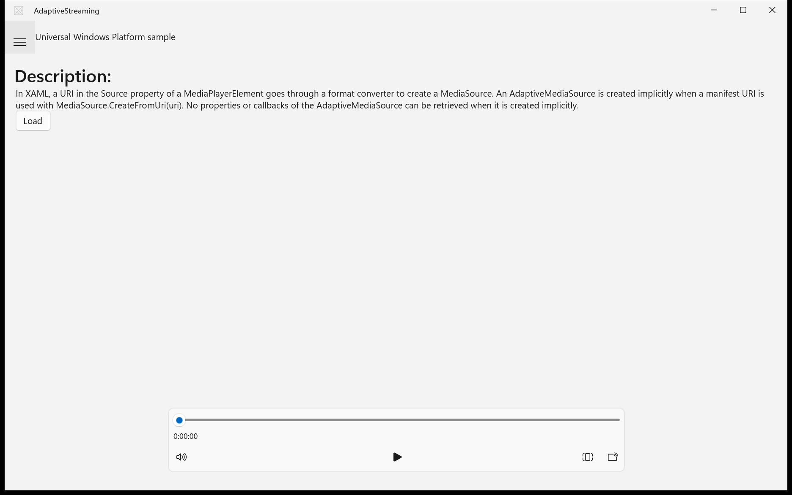

# Migration Score: AdaptiveStreaming

| Metric | Value |
|--------|-------|
| Features evaluated | 12 |
| Pass | 2 |
| Partial | 1 |
| Fail | 9 |
| **Weighted score** | **20.0%** |

---

## Navigation / Scenario list with SplitView navigation

**Verdict:** ❌ Fail

The SplitView pane with ListBox scenario list does not render. The hamburger button exists but clicking it does not open the pane. All 7 scenarios are unreachable via UI navigation. Missing assets (microsoft-sdk.png, windows-sdk.png) may contribute.

| UWP reference | WinUI 3 result |
|---------------|----------------|
| _not captured_ |  |

**Expected behaviour checklist:**
- [ ] A left sidebar pane lists all 7 scenarios by title
- [ ] Clicking a scenario navigates the content frame to that scenario's page
- [ ] A hamburger button toggles the sidebar pane open/closed
- [x] The header shows 'Universal Windows Platform sample' branding

---

## Navigation / Status bar

**Verdict:** ❌ Fail

Status bar is not visible. May be collapsed by design (empty status) but the SplitView layout issue may hide it.

---

## Scenarios / Scenario 1: Simplest Adaptive Streaming

**Verdict:** ✅ Pass

Renders correctly: Description text, Load button, and MediaPlayerElement with transport controls.

---

## Scenarios / Scenarios 2-7

**Verdict:** ❌ Fail (all)

Cannot navigate to any of these scenarios because the SplitView navigation pane is broken.

---

## Controls / ContentSelector

**Verdict:** ❌ Fail — unreachable (only in scenarios 2-7)

---

## Controls / LogView

**Verdict:** ⚠️ Partial — code compiles but cannot verify at runtime

---

## Media / MediaPlayerElement with transport controls

**Verdict:** ✅ Pass

Works in Scenario 1 with all transport controls visible.
